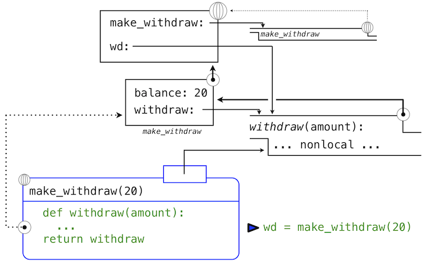
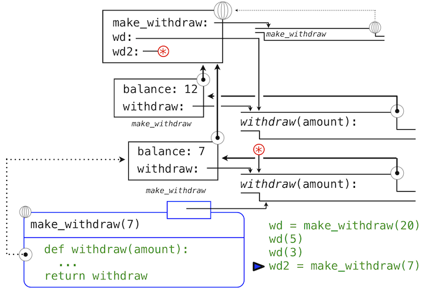

# 2.4 可变数据

> 来源：[2.4   Mutable Data](http://www-inst.eecs.berkeley.edu/~cs61a/sp12/book/objects.html#mutable-data)

> 译者：[飞龙](https://github.com/wizardforcel)

> 协议：[CC BY-NC-SA 4.0](http://creativecommons.org/licenses/by-nc-sa/4.0/)

我们已经看到了抽象在帮助我们应对大型系统的复杂性时如何至关重要。有效的程序整合也需要一些组织原则，指导我们构思程序的概要设计。特别地，我们需要一些策略来帮助我们构建大型系统，使之模块化。也就是说，它们可以“自然”划分为可以分离开发和维护的各个相关部分。

我们用于创建模块化程序的强大工具之一，是引入可能会随时间改变的新类型数据。这样，单个数据可以表示独立于其他程序演化的东西。对象行为的改变可能会由它的历史影响，就像世界中的实体那样。向数据添加状态是这一章最终目标：面向对象编程的要素。

我们目前引入的原生数据类型 -- 数值、布尔值、元组、范围和字符串 -- 都是不可变类型的对象。虽然名称的绑定可以在执行过程中修改为环境中不同的值，但是这些值本身不会改变。这一章中，我们会介绍一组可变数据类型。可变对象可以在程序执行期间改变。

## 2.4.1 局部状态

我们第一个可变对象的例子就是局部状态。这个状态会在程序执行期间改变。

为了展示函数的局部状态是什么东西，让我们对从银行取钱的情况进行建模。我们会通过创建叫做`withdraw`的函数来实现它，它将要取出的金额作为参数。如果账户中有足够的钱来取出，`withdraw`应该返回取钱之后的余额。否则，`withdraw`应该返回消息`'Insufficient funds'`。例如，如果我们以账户中的`$100`开始，我们希望通过调用`withdraw`来得到下面的序列：

```py
>>> withdraw(25)
75
>>> withdraw(25)
50
>>> withdraw(60)
'Insufficient funds'
>>> withdraw(15)
35
```

观察表达式`withdraw(25)`，求值了两次，产生了不同的值。这是一种用户定义函数的新行为：它是非纯函数。调用函数不仅仅返回一个值，同时具有以一些方式修改函数的副作用，使带有相同参数的下次调用返回不同的结果。我们所有用户定义的函数，到目前为止都是纯函数，除非他们调用了非纯的内建函数。它们仍旧是纯函数，因为它们并不允许修改任何在局部环境帧之外的东西。

为了使`withdraw`有意义，它必须由一个初始账户余额创建。`make_withdraw`函数是个高阶函数，接受起始余额作为参数，`withdraw`函数是它的返回值。

```py
>>> withdraw = make_withdraw(100)
```

`make_withdraw`的实现需要新类型的语句：`nonlocal`语句。当我们调用`make_withdraw`时，我们将名称`balance`绑定到初始值上。之后我们定义并返回了局部函数，`withdraw`，它在调用时更新并返回`balance`的值。

```py
>>> def make_withdraw(balance):
        """Return a withdraw function that draws down balance with each call."""
        def withdraw(amount):
            nonlocal balance                 # Declare the name "balance" nonlocal
            if amount > balance:
                return 'Insufficient funds'
            balance = balance - amount       # Re-bind the existing balance name
            return balance
        return withdraw
```

这个实现的新奇部分是`nonlocal`语句，无论什么时候我们修改了名称`balance`的绑定，绑定都会在`balance`所绑定的第一个帧中修改。回忆一下，在没有`nonlocal`语句的情况下，赋值语句总是会在环境的第一个帧中绑定名称。`nonlocal`语句表明，名称出现在环境中不是第一个（局部）帧，或者最后一个（全局）帧的其它地方。

我们可以将这些修改使用环境图示来可视化。下面的环境图示展示了每个调用的效果，以上面的定义开始。我们省略了函数值中的代码，以及不在我们讨论中的表达式树。


我们的定义语句拥有平常的效果：它创建了新的用户定义函数，并且将名称`make_withdraw`在全局帧中绑定到那个函数上。

下面，我们使用初始的余额参数`20`来调用`make_withdraw`。

```py
>>> wd = make_withdraw(20)
```

这个赋值语句将名称`wd`绑定到全局帧中的返回函数上：



所返回的函数，（内部）叫做`withdraw`，和定义所在位置即`make_withdraw`的局部环境相关联。名称`balance`在这个局部环境中绑定。在例子的剩余部分中，`balance`名称只有这一个绑定，这非常重要。

下面，我们求出以总数`5`调用`withdraw`的表达式的值：

```py
>>> wd(5)
15
```

名称`wd`绑定到了`withdraw`函数上，所以`withdraw`的函数体在新的环境中求值，新的环境扩展自`withdraw`定义所在的环境。跟踪`withdraw`求值的效果展示了 Python 中`nonlocal`语句的效果。


`withdraw`的赋值语句通常在`withdraw`的局部帧中为`balance`创建新的绑定。由于`nonlocal`语句，赋值运算找到了`balance`定义位置的第一帧，并在那里重新绑定名称。如果`balance`之前没有绑定到值上，那么`nonlocal`语句会产生错误。

通过修改`balance`绑定的行为，我们也修改了`withdraw`函数。下次`withdraw`调用的时候，名称`balance`会求值为`15`而不是`20`。

当我们第二次调用`wd`时，

```py
>>> wd(3)
12
```

我们发现绑定到`balance`的值的修改可在两个调用之间积累。


这里，第二次调用`withdraw`会创建第二个局部帧，像之前一样，但是，`withdraw`的两个帧都扩展自`make_withdraw`的环境，它们都包含`balance`的绑定。所以，它们共享特定的名称绑定，调用`withdraw`具有改变环境的副作用，并且会由之后的`withdraw`调用继承。

**实践指南。**通过引入`nonlocal`语句，我们发现了赋值语句的双重作用。它们修改局部绑定，或者修改非局部绑定。实际上，赋值语句已经有了两个作用：创建新的绑定，或者重新绑定现有名称。Python 赋值的许多作用使赋值语句的执行效果变得模糊。作为一个程序员，你应该用文档清晰记录你的代码，使赋值的效果可被其它人理解。

## 2.4.2 非局部赋值的好处

非局部赋值是将程序作为独立和自主的对象观察的重要步骤，对象彼此交互，但是各自管理各自的内部状态。

特别地，非局部赋值提供了在函数的局部范围中维护一些状态的能力，这些状态会在函数之后的调用中演化。和特定`withdraw`函数相关的`balance`在所有该函数的调用中共享。但是，`withdraw`实例中的`balance`绑定对程序的其余部分不可见。只有`withdraw`关联到了`make_withdraw`的帧，`withdraw`在那里被定义。如果`make_withdraw`再次调用，它会创建单独的帧，带有单独的`balance`绑定。

我们可以继续以我们的例子来展示这个观点。`make_withdraw`的第二个调用返回了第二个`withdraw`函数，它关联到了另一个环境上。

```py
>>> wd2 = make_withdraw(7)
```

第二个`withdraw`函数绑定到了全局帧的名称`wd2`上。我们使用星号来省略了表示这个绑定的线。现在，我们看到实际上有两个`balance`的绑定。名称`wd`仍旧绑定到余额为`12`的`withdraw`函数上，而`wd2`绑定到了余额为`7`的新的`withdraw`函数上。



最后，我们调用绑定到`wd2`上的第二个`withdraw`函数：

```py
>>> wd2(6)
1
```

这个调用修改了非局部名称`balance`的绑定，但是不影响在全局帧中绑定到名称`wd`的第一个`withdraw`。


这样，`withdraw`的每个实例都维护它自己的余额状态，但是这个状态对程序中其它函数不可见。在更高层面上观察这个情况，我们创建了银行账户的抽象，它管理自己的内部状态，但以一种方式对真实世界的账户进行建模：它基于自己的历史提取请求来随时间变化。
