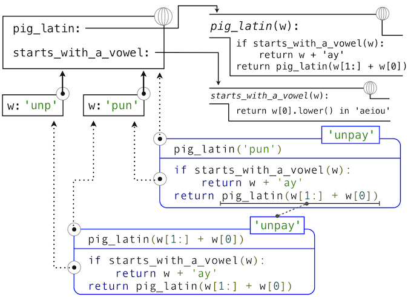

# 3.2 函数和所生成的过程

> 来源：[3.2   Functions and the Processes They Generate](http://www-inst.eecs.berkeley.edu/~cs61a/sp12/book/interpretation.html#functions-and-the-processes-they-generate)

> 译者：[飞龙](https://github.com/wizardforcel)

> 协议：[CC BY-NC-SA 4.0](http://creativecommons.org/licenses/by-nc-sa/4.0/)

函数式计算机程序的局部演化的模式。它规定了过程的每个阶段如何构建与之前的阶段之上。我们希望能够创建有关过程整体行为的语句，过程的局部演化由一个或多个函数指定。这种分析通常非常困难，但是我们至少可以试图描述一些典型的过程演化模式。

在这一章中，我们会检测一些用户简单函数所生成的过程的通用“模型”。我们也会研究程序消耗重要的计算资源，例如时间和空间的比例。

## 3.2.1 递归函数

如果函数的函数体直接或者间接自己调用自己，那么这个函数是递归的。也就是说，递归函数的执行过程可能需要再次调用这个函数。Python 中的递归函数不需要任何特殊的语法，但是它们的确需要一些注意来正确定义。

作为递归函数的介绍，我们以将英文单词转换为它的 Pig Latin 等价形式开始。Pig Latin 是一种隐语：对英文单词使用一种简单、确定的转换来掩盖单词的含义。据推测 Thomas Jefferson 是[先行者](http://goo.gl/Cwysz)。英文单词的 Pig Latin 等价形式将辅音前缀（可能为空）从开头移动到末尾，并且添加`-ay`元音。所以，`pun`会变成`unpay`，`stout`会变成`outstay`，`all`会变成`allay`。

```py
>>> def pig_latin(w):
        """Return the Pig Latin equivalent of English word w."""
        if starts_with_a_vowel(w):
            return w + 'ay'
        return pig_latin(w[1:] + w[0])
>>> def starts_with_a_vowel(w):
        """Return whether w begins with a vowel."""
        return w[0].lower() in 'aeiou'
```

这个定义背后的想法是，一个以辅音开头的字符串的 Pig Latin 变体和另一个字符串的 Pig Latin 变体相同：它通过将第一个字母移到最后来创建。于是，`sending`的 Pig Latin 变体就和`endings`的变体（`endingsay`）相同。`smother`的 Pig Latin 变体和`mothers`的变体（`othersmay`）相同。而且，将辅音从开头移动到结尾会造成带有更少辅音前缀的更简单的问题。在`sending`的例子中，将`s`移动到末尾会产生以原因开头的单词，我们的任务就完成了。

`pig_latin`的定义是完整且正确的，即使`pig_latin`函数在它的函数体中调用。

```py
>>> pig_latin('pun')
'unpay'
```

能够基于函数自身来定义函数的想法可能十分令人混乱：“循环”定义如何能够有意义，这看起来不是很清楚，更不用说让计算机来指定定义好的过程。但是，我们能够准确理解递归函数如何使用我们的计算环境模式来成功调用。环境的图示和描述`pig_latin('pun')`求值的表达式树展示在下面：



Python 求值过程的步骤产生如下结果：

1.  `pig_latin `的`def`语句 被执行，其中：
    1.  使用函数体创建新的`pig_latin`函数对象，并且
    2.  将名称`pig_latin`在当前（全局）帧中绑定到这个函数上。
2.  `starts_with_a_vowel `的`def`语句类似地执行。
3.  求出`pig_latin('pun')`的调用表达式，通过
    1.  求出运算符和操作数子表达式，通过
        1.  查找绑定到`pig_latin`函数的`pig_latin`名称
        2.  对字符串对象`'pun'`求出操作数字符串字面值
    2.  在参数`'pun'`上调用`pig_latin`函数，通过
        1.  添加扩展自全局帧的局部帧
        2.  将形参`w`绑定到当前帧的实参`'pun'`上。
        3.  在以当前帧起始的环境中执行`pig_latin`的函数体
            1.  最开始的条件语句没有效果，因为头部表达式求值为`False`
            2.  求出最后的返回表达式`pig_latin(w[1:] + w[0])`，通过
                1.  查找绑定到`pig_latin`函数的`pig_latin`名称
                2.  对字符串对象`'pun'`求出操作数表达式
                3.  在参数`'unp'`上调用`pig_latin`，它会从`pig_latin`函数体中的条件语句组返回预期结果。

就像这个例子所展示的那样，递归函数正确调用，虽然它具有循环特征。`pig_latin`函数调用了两次，但是每次都带有不同的参数。虽然第二个调用来自`pig_latin`自己的函数体，由名称查找函数会成功，因为名称`pig_latin`在它的函数体执行前的环境中绑定。

这个例子也展示了 Python 的递归函数的求值过程如何与递归函数交互，来产生带有许多嵌套步骤的复杂计算过程，即使函数定义本身可能包含非常少的代码行数。
