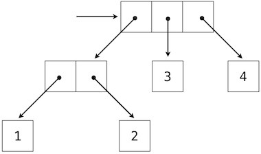

# 3.3 递归数据结构

> 来源：[3.3   Recursive Data Structures](http://www-inst.eecs.berkeley.edu/~cs61a/sp12/book/interpretation.html#recursive-data-structures)

> 译者：[飞龙](https://github.com/wizardforcel)

> 协议：[CC BY-NC-SA 4.0](http://creativecommons.org/licenses/by-nc-sa/4.0/)

在第二章中，我们引入了偶对的概念，作为一种将两个对象结合为一个对象的机制。我们展示了偶对可以使用内建元素来实现。偶对的封闭特性表明偶对的每个元素本身都可以为偶对。

这个封闭特性允许我们实现递归列表的数据抽象，它是我们的第一种序列类型。递归列表可以使用递归函数最为自然地操作，就像它们的名称和结构表示的那样。在这一节中，我们会讨论用户创建和操作秭归列表和其它递归结构的函数。

## 3.3.1 处理递归列表

递归列表结构将列表表示为首个元素和列表的剩余部分。我们之前使用函数实现了递归列表，但是现在我们可以使用类来重新实现。下面，长度（`__len__`）和元素选择（`__getitem__`）被重写来展示处理递归列表的典型模式。

```py
>>> class Rlist(object):
        """A recursive list consisting of a first element and the rest."""
        class EmptyList(object):
            def __len__(self):
                return 0
        empty = EmptyList()
        def __init__(self, first, rest=empty):
            self.first = first
            self.rest = rest
        def __repr__(self):
            args = repr(self.first)
            if self.rest is not Rlist.empty:
                args += ', {0}'.format(repr(self.rest))
            return 'Rlist({0})'.format(args)
        def __len__(self):
            return 1 + len(self.rest)
        def __getitem__(self, i):
            if i == 0:
                return self.first
            return self.rest[i-1]
```

`__len__`和`__getitem__`的定义实际上是递归的，虽然不是那么明显。Python 内建函数`len`在用户定对象参数上调用时会寻找叫做`__len__`的方法。与之类似，下标运算符会寻找叫做`__getitem__`的方法。于是，这些定义会以调用自身而结束。在剩余部分上的递归调用是递归列表处理的普遍模式。这个递归列表的类定义与 Python 的内建序列和打印操作能够合理交互。

```py
>>> s = Rlist(1, Rlist(2, Rlist(3)))
>>> s.rest
Rlist(2, Rlist(3))
>>> len(s)
3
>>> s[1]
2
```

创建新的列表的操作能够世界使用递归来表示。例如，我们可以定义`extend_rlist`函数，它接受两个递归列表作为参数并组合二者的元素到新的列表中。

```py
>>> def extend_rlist(s1, s2):
        if s1 is Rlist.empty:
            return s2
        return Rlist(s1.first, extend_rlist(s1.rest, s2))
>>> extend_rlist(s.rest, s)
Rlist(2, Rlist(3, Rlist(1, Rlist(2, Rlist(3)))))
```

与之类似，在递归列表上映射函数展示了相似的模式：

```py
>>> def map_rlist(s, fn):
        if s is Rlist.empty:
            return s
        return Rlist(fn(s.first), map_rlist(s.rest, fn))
>>> map_rlist(s, square)
Rlist(1, Rlist(4, Rlist(9)))
```

过滤操作包括额外的条件语句，但是也拥有相似的递归结构。

```py
>>> def filter_rlist(s, fn):
        if s is Rlist.empty:
            return s
        rest = filter_rlist(s.rest, fn)
        if fn(s.first):
            return Rlist(s.first, rest)
        return rest
>>> filter_rlist(s, lambda x: x % 2 == 1)
Rlist(1, Rlist(3))
```
列表操作的递归实现通常不需要局部赋值或者`while`语句。反之，递归列表可以作为函数调用的结果来拆分和构造。所以，它们拥有步骤数目和所需空间的线性增长度。

## 3.3.2 层次结构

层次结构产生于数据的封闭特性，例如，元组可以包含其它元组。例如，考虑这个数值`1`到`4`的嵌套表示。

```py
>>> ((1, 2), 3, 4)
((1, 2), 3, 4)
```

这个元组是个长度为 3 的序列，它的第一个元素也是一个元组。这个嵌套结构的盒子和指针的图示表明，它可以看做拥有四个叶子的书，每个都是一个数值。



在树中，每个子树本身都是一棵树。作为基本条件，任何本身不是元组的元素都是一个简单的树，他没有任何枝干。也就是说，所有数值都是数，就像在偶对`(1, 2)`和整个结构中那样。

递归时用户处理树形结构的自然工具，因为我们通常可以将树的操作降至枝干的操作，它会相应产生枝干的枝干的操作，以此类推，直到我们到达了树的叶子。例如，我们可以实现`count_leaves`函数，它返回树的叶子总数。

```py
>>> t = ((1, 2), 3, 4)
>>> count_leaves(t)
4
>>> big_tree = ((t, t), 5)
>>> big_tree
((((1, 2), 3, 4), ((1, 2), 3, 4)), 5)
>>> count_leaves(big_tree)
9
```

正如`map`是用于处理序列的强大工具，映射和递归一起为树的操作提供了强大而通用的计算形式。例如，我们可以使用高阶递归函数`map_tree `将树的每个叶子平方，它的结构类似于`count_leaves`。

```py
>>> def map_tree(tree, fn):
        if type(tree) != tuple:
            return fn(tree)
        return tuple(map_tree(branch, fn) for branch in tree)
>>> map_tree(big_tree, square)
((((1, 4), 9, 16), ((1, 4), 9, 16)), 25)
```

**内部值。**上面描述的树只在叶子上有值。另一个通用的树形结构表示也在树的内部节点上优质。我们使用类来表示这种树。

```py
>>> class Tree(object):
        def __init__(self, entry, left=None, right=None):
            self.entry = entry
            self.left = left
            self.right = right
        def __repr__(self):
            args = repr(self.entry)
            if self.left or self.right:
                args += ', {0}, {1}'.format(repr(self.left), repr(self.right))
            return 'Tree({0})'.format(args)
```

例如，`Tree`类可以为`fib`的递归实现表示表达式树中计算的值。`fib`函数用户计算斐波那契数。下面的函数`fib_tree(n)`返回`Tree`，它将第 n 个斐波那契树作为`entry`，并将所有之前计算出来的斐波那契数存入它的枝干中。

```py
>>> def fib_tree(n):
        """Return a Tree that represents a recursive Fibonacci calculation."""
        if n == 1:
            return Tree(0)
        if n == 2:
            return Tree(1)
        left = fib_tree(n-2)
        right = fib_tree(n-1)
        return Tree(left.entry + right.entry, left, right)
>>> fib_tree(5)
Tree(3, Tree(1, Tree(0), Tree(1)), Tree(2, Tree(1), Tree(1, Tree(0), Tree(1))))
```

这个例子表明，表达式树可以使用树形结构编程表示。嵌套表达式和属性数据结构的联系在我们这一章稍后对解释器设计的讨论中起到核心作用。

## 3.3.3 集合

除了列表、元组和字典之外，Python 拥有第四种容器类型，叫做`set`。集合字面上遵循元素以花括号闭合的数学表示。重复的元素在构造中会移除。集合是无序容器，所以打印出来的顺序可能和元素在集合字面值中的顺序不同。

```py
>>> s = {3, 2, 1, 4, 4}
>>> s
{1, 2, 3, 4}
```

Python 的集合支持多种操作，包括成员测试、长度计算和标准的交集并集操作。

```py
>>> 3 in s
True
>>> len(s)
4
>>> s.union({1, 5})
{1, 2, 3, 4, 5}
>>> s.intersection({6, 5, 4, 3})
{3, 4}
```

除了`union`和`intersection`，Python 的集合还支持多种其它操作。断言`isdisjoint`、`issubset`和`issuperset`提供了集合比较。集合是可变的，并且可以使用`add`、·remove`、`discard`和`pop`一次修改一个元素。额外的方法提供了多元素的修改，例如`clear`和`update`。Python [集合文档](http://docs.python.org/py3k/library/stdtypes.html#set)十分详细并足够易懂。

**实现集合。**抽象上，集合是不同对象的容器，支持成员测试、取交、取并和附加操作。向集合添加元素会返回新的集合，它包含原始集合的所有元素，如果没有重复的话，也包含新的元素。并和交的运算返回出现在任意一个或两个集合中的元素构成的集合。就像任何数据抽象那样，我们可以随意实现任何集合表示上的任何函数，只要它们提供这种行为。

在这章的神域部分，我们会考虑三个实现集合的不同方式，它们在表示上不同。我们会刻画这些不同表示的效率。通过分析集合操作的增长读。我们也会使用这一章之前的`Rlist`和`Tree`类，它们可以编写用于集合元素操作的简单而优雅的递归解决方案。

**作为无序序列的集合。**一种集合的表示方式是看做没有出现多于一次的元素的序列。空集由空序列来表示。成员测试会递归遍历整个列表。

```py
>>> def empty(s):
        return s is Rlist.empty
>>> def set_contains(s, v):
        """Return True if and only if set s contains v."""
        if empty(s):
            return False
        elif s.first == v:
            return True
        return set_contains(s.rest, v)
>>> s = Rlist(1, Rlist(2, Rlist(3)))
>>> set_contains(s, 2)
True
>>> set_contains(s, 5)
False
```

这个`set_contains `的实现需要`Θ(n)`的时间来测试元素的成员性，其中`n`是集合`s`的大小。使用这个线性时间的成员测试函数，我们可以将元素添加到集合中，也是线性时间。

```py
>>> def adjoin_set(s, v):
        """Return a set containing all elements of s and element v."""
        if set_contains(s, v):
            return s
        return Rlist(v, s)
>>> t = adjoin_set(s, 4)
>>> t
Rlist(4, Rlist(1, Rlist(2, Rlist(3))))
```

在设计表示中，一个问题是我们应该关注效率。队两个集合`set1`和`set2`取交需要成员测试，但是这一次每个`set1`的元素必须测试`set2`中的呈圆形，对于两个大小为`n`的集合，这会产生步骤数量上的平方增长度`Θ(n^2)`。

```py
>>> def intersect_set(set1, set2):
        """Return a set containing all elements common to set1 and set2."""
        return filter_rlist(set1, lambda v: set_contains(set2, v))
>>> intersect_set(t, map_rlist(s, square))
Rlist(4, Rlist(1))
```

在计算两个集合的并时，我们必须小心不要两次包含任意一个元素。`union_set `函数也需要线性数量的成员测试，同样会产生包含`Θ(n^2)`步骤的过程。

```py
>>> def union_set(set1, set2):
        """Return a set containing all elements either in set1 or set2."""
        set1_not_set2 = filter_rlist(set1, lambda v: not set_contains(set2, v))
        return extend_rlist(set1_not_set2, set2)
>>> union_set(t, s)
Rlist(4, Rlist(1, Rlist(2, Rlist(3))))
```

**作为有序元组的集合。**一种加速我们的集合操作的方式是修改表示，使集合元素递增排列。为了这样做，我们需要一些方式来比较两个对象，使我们能判断哪个更大。Python 中，许多不同对象类型都可以使用`<`和`>`运算符比较，但是我们会专注于这个例子中的数值。我们会通过将元素递增排列来表示数值集合。

有序的一个优点会在`set_contains`体现：在检查对象是否存在时，我们不再需要扫描整个集合。如果我们到达了大于要寻找的元素的集合元素，我们就知道这个元素不在集合中：

```py
>>> def set_contains(s, v):
        if empty(s) or s.first > v:
            return False
        elif s.first == v:
            return True
        return set_contains(s.rest, v)
>>> set_contains(s, 0)
False
```

