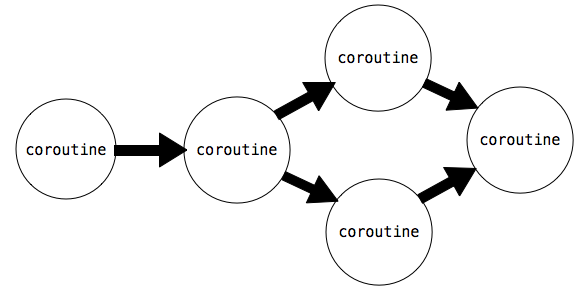
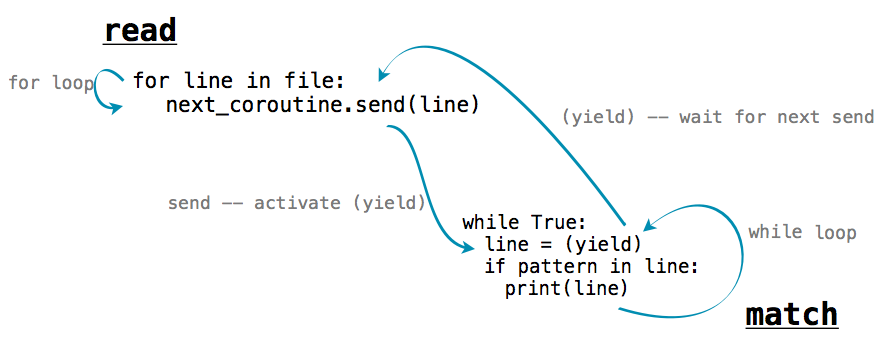

# 第五章 序列和协程

> 来源：[Chapter 5: Sequences and Coroutines](http://www-inst.eecs.berkeley.edu/~cs61a/sp12/book/streams.html)

> 译者：[飞龙](https://github.com/wizardforcel)

> 协议：[CC BY-NC-SA 4.0](http://creativecommons.org/licenses/by-nc-sa/4.0/)

## 5.1 引言

在这一章中，我们通过开发新的工具来处理有序数据，继续讨论真实世界中的应用。在第二章中，我们介绍了序列接口，在 Python 内置的数据类型例如`tuple`和`list`中实现。序列支持两个操作：获取长度和由下标访问元素。第三章中，我们开发了序列接口的用户定义实现，用于表示递归列表的`Rlist`类。序列类型具有高效的表现力，并且可以让我们高效访问大量有序数据集。

但是，使用序列抽象表示有序数据有两个重要限制。第一个是长度为`n`的序列的要占据比例为`n`的内存总数。于是，序列越长，表示它所占的内存空间就越大。

第二个限制是，序列只能表示已知且长度有限的数据集。许多我们想要表示的有序集合并没有定义好的长度，甚至有些是无限的。两个无限序列的数学示例是正整数和斐波那契数。无限长度的有序数据集也出现在其它计算领域，例如，所有推特状态的序列每秒都在增长，所以并没有固定的长度。与之类似，经过基站发送出的电话呼叫序列，由计算机用户发出的鼠标动作序列，以及飞机上的传感器产生的加速度测量值序列，都在世界演化过程中无限扩展。

在这一章中，我们介绍了新的构造方式用于处理有序数据，它为容纳未知或无限长度的集合而设计，但仅仅使用有限的内存。我们也会讨论这些工具如何用于一种叫做协程的程序结构，来创建高效、模块化的数据处理流水线。

## 5.2 隐式序列

序列可以使用一种程序结构来表示，它不将每个元素显式储存在内存中，这是高效处理有序数据的核心概念。为了将这个概念用于实践，我们需要构造对象来提供序列中所有元素的访问，但是不要事先把所有元素计算出来并储存。

这个概念的一个简单示例就是第二章出现的`range`序列类型。`range`表示连续有界的整数序列。但是，它的每个元素并不显式在内存中表示，当元素从`range`中获取时，才被计算出来。所以，我们可以表示非常大的整数范围。只有范围的结束位置才被储存为`range`对象的一部分，元素都被凭空计算出来。

```py
>>> r = range(10000, 1000000000)
>>> r[45006230]
45016230
```

这个例子中，当构造范围示例时，并不是这个范围内的所有 999,990,000 个整数都被储存。反之，范围对象将第一个元素 10,000 与下标相加 45,006,230 来产生第 45,016,230 个元素。计算所求的元素值并不从现有的表示中获取，这是惰性计算的一个例子。计算机科学将惰性作为一种重要的计算工具加以赞扬。

迭代器是提供底层有序数据集的有序访问的对象。迭代器在许多编程语言中都是内建对象，包括 Python。迭代器抽象拥有两个组成部分：一种获取底层元素序列的下一个元素的机制，以及一种标识元素序列已经到达末尾，没有更多剩余元素的机制。在带有内建对象系统的编程语言中，这个抽象通常相当于可以由类实现的特定接口。Python 的迭代器接口会在下一节中描述。

迭代器的实用性来源于一个事实，底层数据序列并不能显式在内存中表达。迭代器提供了一种机制，可以依次计算序列中的每个值，但是所有元素不需要连续储存。反之，当下个元素从迭代器获取的时候，这个元素会按照请求计算，而不是从现有的内存来源中获取。

范围可以惰性计算序列中的元素，因为序列的表示是统一的，并且任何元素都可以轻易从范围的起始和结束位置计算出来。迭代器支持更广泛的底层有序数据集的惰性生成，因为它们不需要提供底层序列任意元素的访问途径。反之，它们仅仅需要按照顺序，在每次其它元素被请求的时候，计算出序列的下一个元素。虽然不像序列可访问任意元素那样灵活（叫做随机访问），有序数据序列的顺序访问对于数据处理应用来说已经足够了。

### 5.2.1 Python 迭代器

Python 迭代器接口包含两个消息。`__next__`消息向迭代器获取所表示的底层序列的下一个元素。为了对`__next__`方法调用做出回应，迭代器可以执行任何计算来获取或计算底层数据序列的下一个元素。`__next__`的调用让迭代器产生变化：它们向前移动迭代器的位置。所以多次调用`__next__`会有序返回底层序列的元素。在`__next__`的调用过程中，Python 通过`StopIteration`异常，来表示底层数据序列已经到达末尾。

下面的`Letters`类迭代了从`a`到`d`字母的底层序列。成员变量`current`储存了序列中的当前字母。`__next__`方法返回这个字母，并且使用它来计算`current`的新值。

```py
>>> class Letters(object):
        def __init__(self):
            self.current = 'a'
        def __next__(self):
            if self.current > 'd':
                raise StopIteration
            result = self.current
            self.current = chr(ord(result)+1)
            return result
        def __iter__(self):
            return self
```

`__iter__`消息是 Python 迭代器所需的第二个消息。它只是简单返回迭代器，它对于提供迭代器和序列的通用接口很有用，在下一节会描述。

使用这个类，我们就可以访问序列中的字母：

```py
>>> letters = Letters()
>>> letters.__next__()
'a'
>>> letters.__next__()
'b'
>>> letters.__next__()
'c'
>>> letters.__next__()
'd'
>>> letters.__next__()
Traceback (most recent call last):
  File "<stdin>", line 1, in <module>
  File "<stdin>", line 12, in next
StopIteration
```

`Letters`示例只能迭代一次。一旦`__next__()`方法产生了`StopIteration`异常，它就从此之后一直这样了。除非创建新的实例，否则没有办法来重置它。

迭代器也允许我们表示无限序列，通过实现永远不会产生`StopIteration`异常的`__next__`方法。例如，下面展示的`Positives`类迭代了正整数的无限序列：

```py
>>> class Positives(object):
        def __init__(self):
            self.current = 0;
        def __next__(self):
            result = self.current
            self.current += 1
            return result
        def __iter__(self):
            return self
```

### 5.2.2 `for`语句

Python 中，序列可以通过实现`__iter__`消息用于迭代。如果一个对象表示有序数据，它可以在`for`语句中用作可迭代对象，通过回应`__iter__`消息来返回迭代器。这个迭代器应拥有`__next__()`方法，依次返回序列中的每个元素，最后到达序列末尾时产生`StopIteration`异常。

```py
>>> counts = [1, 2, 3]
>>> for item in counts:
        print(item)
1
2
3
```

在上面的实例中，`counts`列表返回了迭代器，作为`__iter__()`方法调用的回应。`for`语句之后反复调用迭代器的`__next__()`方法，并且每次都将返回值赋给`item`。这个过程一直持续，直到迭代器产生了`StopIteration`异常，这时`for`语句就终止了。

使用我们关于迭代器的知识，我们可以拿`while`、赋值和`try`语句实现`for`语句的求值规则：

```py
>>> i = counts.__iter__()
>>> try:
        while True:
            item = i.__next__()
            print(item)
    except StopIteration:
        pass
1
2
3
```

在上面，调用`counts`的`__iter__`方法所返回的迭代器绑定到了名称`i`上面，便于依次获取每个元素。`StopIteration`异常的处理子句不做任何事情，但是这个异常的处理提供了退出`while`循环的控制机制。

### 5.2.3 生成器和`yield`语句

上面的`Letters`和`Positives`对象需要我们引入一种新的字段，`self.current`，来跟踪序列的处理过程。在上面所示的简单序列中，这可以轻易实现。但对于复杂序列，`__next__()`很难在计算中节省空间。生成器允许我们通过利用 Python 解释器的特性定义更复杂的迭代。

生成器是由一类特殊函数，叫做生成器函数返回的迭代器。生成器函数不同于普通的函数，因为它不在函数体中包含`return`语句，而是使用`yield`语句来返回序列中的元素。

生成器不使用任何对象属性来跟踪序列的处理过程。它们控制生成器函数的执行，每次`__next__`方法调用时，它们执行到下一个`yield`语句。`Letters`迭代可以使用生成器函数实现得更加简洁。

```py
>>> def letters_generator():
        current = 'a'
        while current <= 'd':
            yield current
            current = chr(ord(current)+1)
>>> for letter in letters_generator():
        print(letter)
a
b
c
d
```

即使我们永不显式定义`__iter__()`或`__next__()`方法，Python 会理解当我们使用`yield`语句时，我们打算定义生成器函数。调用时，生成器函数并不返回特定的产出值，而是返回一个生成器（一种迭代器），它自己就可以返回产出的值。生成器对象拥有`__iter__`和`__next__`方法，每个对`__next__`的调用都会从上次停留的地方继续执行生成器函数，直到另一个`yield`语句执行的地方。

`__next__`第一次调用时，程序从`letters_generator`的函数体一直执行到进入`yield`语句。之后，它暂停并返回`current`值。`yield`语句并不破坏新创建的环境，而是为之后的使用保留了它。当`__next__`再次调用时，执行在它停留的地方恢复。`letters_generator`作用域中`current`和任何所绑定名称的值都会在随后的`__next__`调用中保留。

我们可以通过手动调用`__next__()`来遍历生成器：

```py
>>> letters = letters_generator()
>>> type(letters)
<class 'generator'>
>>> letters.__next__()
'a'
>>> letters.__next__()
'b'
>>> letters.__next__()
'c'
>>> letters.__next__()
'd'
>>> letters.__next__()
Traceback (most recent call last):
  File "<stdin>", line 1, in <module>
StopIteration
```

在第一次`__next__()`调用之前，生成器并不会开始执行任何生成器函数体中的语句。

### 5.2.4 可迭代对象

Python 中，迭代只会遍历一次底层序列的元素。在遍历之后，迭代器在`__next__()`调用时会产生`StopIteration`异常。许多应用需要迭代多次元素。例如，我们需要对一个列表迭代多次来枚举所有的元素偶对：


```py
>>> def all_pairs(s):
        for item1 in s:
            for item2 in s:
                yield (item1, item2)
>>> list(all_pairs([1, 2, 3]))
[(1, 1), (1, 2), (1, 3), (2, 1), (2, 2), (2, 3), (3, 1), (3, 2), (3, 3)]
```

序列本身不是迭代器，但是它是可迭代对象。Python 的可迭代接口只包含一个消息，`__iter__`，返回一个迭代器。Python 中内建的序列类型在`__iter__`方法调用时，返回迭代器的新实例。如果一个可迭代对象在每次调用`__iter__`时返回了迭代器的新实例，那么它就能被迭代多次。

新的可迭代类可以通过实现可迭代接口来定义。例如，下面的可迭代对象`LetterIterable`类在每次调用`__iter__`时返回新的迭代器来迭代字母。

```py
>>> class LetterIterable(object):
        def __iter__(self):
            current = 'a'
            while current <= 'd':
                yield current
                current = chr(ord(current)+1)
```

`__iter__`方法是个生成器函数，它返回一个生成器对象，产出从`'a'`到`'d'`的字母。

`Letters`迭代器对象在单次迭代之后就被“用完”了，但是`LetterIterable`对象可被迭代多次。所以，`LetterIterable`示例可以用于`all_pairs`的参数。

```py
>>> letters = LetterIterable()
>>> all_pairs(letters).__next__()
('a', 'a')
```

### 5.2.5 流

流提供了一种隐式表示有序数据的最终方式。流是惰性计算的递归列表。就像第三章的`Rlist`类那样，`Stream`实例可以响应对其第一个元素和剩余部分的获取请求。同样，`Stream`的剩余部分还是`Stream`。然而不像`RList`，流的剩余部分只在查找时被计算，而不是事先存储。也就是说流的剩余部分是惰性计算的。

为了完成这个惰性求值，流会储存计算剩余部分的函数。无论这个函数在什么时候调用，它的返回值都作为流的一部分，储存在叫做`_rest`的属性中。下划线表示它不应直接访问。可访问的属性`rest`是个方法，它返回流的剩余部分，并在必要时计算它。使用这个设计，流可以储存计算剩余部分的方式，而不用总是显式储存它们。

```py
>>> class Stream(object):
        """A lazily computed recursive list."""
        def __init__(self, first, compute_rest, empty=False):
            self.first = first
            self._compute_rest = compute_rest
            self.empty = empty
            self._rest = None
            self._computed = False
        @property
        def rest(self):
            """Return the rest of the stream, computing it if necessary."""
            assert not self.empty, 'Empty streams have no rest.'
            if not self._computed:
                self._rest = self._compute_rest()
                self._computed = True
            return self._rest
        def __repr__(self):
            if self.empty:
                return '<empty stream>'
            return 'Stream({0}, <compute_rest>)'.format(repr(self.first))
>>> Stream.empty = Stream(None, None, True)
```

递归列表可使用嵌套表达式来定义。例如，我们可以创建`RList`，来表达`1`和`5`的序列，像下面这样：

```py
>>> r = Rlist(1, Rlist(2+3, Rlist.empty))
```

与之类似，我们可以创建一个`Stream`来表示相同序列。`Stream`在请求剩余部分之前，并不会实际计算下一个元素`5`。

```py
>>> s = Stream(1, lambda: Stream(2+3, lambda: Stream.empty))
```

这里，`1`是流的第一个元素，后面的`lambda`表达式是用于计算流的剩余部分的函数。被计算的流的第二个元素又是一个返回空流的函数。

访问递归列表`r`和流`s`中的元素拥有相似的过程。但是，`5`储存在了`r`之中，而对于`s`来说，它在首次被请求时通过加法来按要求计算。

```py
>>> r.first
1
>>> s.first
1
>>> r.rest.first
5
>>> s.rest.first
5
>>> r.rest
Rlist(5)
>>> s.rest
Stream(5, <compute_rest>)
```

虽然 `r` 的 `rest` 是一个单元素递归列表，但 `s` 的其余部分包括一个计算其余部分的函数；它将返回空流的事实可能还没有被发现。

当构造一个 `Stream` 实例时，字段 `self._computed` 为 `False` ，表示 `Stream` 的 `_rest` 还没有被计算。当通过点表达式请求 `rest` 属性时，会调用 `rest` 方法，以 `self._rest = self.compute_rest` 触发计算。由于 `Stream` 中的缓存机制，`compute_rest` 函数只被调用一次。

`compute_rest` 函数的基本属性是它不接受任何参数，并返回一个 `Stream`。

惰性求值使我们能够用流来表示无限的顺序数据集。例如，我们可以从任意 `first` 开始表示递增的整数。

```py
>>> def make_integer_stream(first=1):
      def compute_rest():
        return make_integer_stream(first+1)
      return Stream(first, compute_rest)
>>> ints = make_integer_stream()
>>> ints
Stream(1, <compute_rest>)
>>> ints.first
1
```

当`make_integer_stream`首次被调用时，它返回了一个流，流的`first`是序列中第一个整数（默认为`1`）。但是，`make_integer_stream`实际是递归的，因为这个流的`compute_rest`以自增的参数再次调用了`make_integer_stream`。这会让`make_integer_stream`变成递归的，同时也是惰性的。

```py
>>> ints.first
1
>>> ints.rest.first
2
>>> ints.rest.rest
Stream(3, <compute_rest>)
```

无论何时请求整数流的`rest`，都仅仅递归调用`make_integer_stream`。

操作序列的相同高阶函数 -- `map`和`filter` -- 同样可应用于流，虽然它们的实现必须修改来惰性调用它们的参数函数。`map_stream`在一个流上映射函数，这会产生一个新的流。局部定义的`compute_rest`函数确保了无论什么时候`rest`被计算出来，这个函数都会在流的剩余部分上映射。

```py
>>> def map_stream(fn, s):
        if s.empty:
            return s
        def compute_rest():
            return map_stream(fn, s.rest)
        return Stream(fn(s.first), compute_rest)
```

流可以通过定义`compute_rest`函数来过滤，这个函数在流的剩余部分上调用过滤器函数。如果过滤器函数拒绝了流的第一个元素，剩余部分会立即计算出来。因为`filter_stream`是递归的，剩余部分可能会多次计算直到找到了有效的`first`元素。

```py
>>> def filter_stream(fn, s):
        if s.empty:
            return s
        def compute_rest():
            return filter_stream(fn, s.rest)
        if fn(s.first):
            return Stream(s.first, compute_rest)
        return compute_rest()
```

`map_stream`和`filter_stream`展示了流式处理的常见模式：无论流的剩余部分何时被计算，局部定义的`compute_rest`函数都会对流的剩余部分递归调用某个处理函数。

为了观察流的内容，我们需要将其截断为有限长度，并转换为 Python `list`。

```py
>>> def truncate_stream(s, k):
        if s.empty or k == 0:
            return Stream.empty
        def compute_rest():
            return truncate_stream(s.rest, k-1)
        return Stream(s.first, compute_rest)
>>> def stream_to_list(s):
        r = []
        while not s.empty:
            r.append(s.first)
            s = s.rest
        return r
```

这些便利的函数允许我们验证`map_stream`的实现，使用一个非常简单的例子，从`3`到`7`的整数平方。

```py
>>> s = make_integer_stream(3)
>>> s
Stream(3, <compute_rest>)
>>> m = map_stream(lambda x: x*x, s)
>>> m
Stream(9, <compute_rest>)
>>> stream_to_list(truncate_stream(m, 5))
[9, 16, 25, 36, 49]
```

我们可以使用我们的`filter_stream`函数来定义素数流，使用埃拉托斯特尼筛法（sieve of Eratosthenes），它对整数流进行过滤，移除第一个元素的所有倍数数值。通过成功过滤出每个素数，所有合数都从流中移除了。

```py
>>> def primes(pos_stream):
        def not_divible(x):
            return x % pos_stream.first != 0
        def compute_rest():
            return primes(filter_stream(not_divible, pos_stream.rest))
        return Stream(pos_stream.first, compute_rest)
```

通过截断`primes`流，我们可以枚举素数的任意前缀：

```py
>>> p1 = primes(make_integer_stream(2))
>>> stream_to_list(truncate_stream(p1, 7))
[2, 3, 5, 7, 11, 13, 17]
```

流和迭代器不同，因为它们可以多次传递给纯函数，并且每次都产生相同的值。素数流并没有在转换为列表之后“用完”。也就是说，在将流的前缀转换为列表之后，`p1`的第一个元素仍旧是`2`。

```py
>>> p1.first
2
```

就像递归列表提供了序列抽象的简单实现，流提供了简单、函数式的递归数据结构，它通过高阶函数的使用实现了惰性求值。

## 5.3 协程

这篇文章的大部分专注于将复杂程序解构为小型、模块化组件的技巧。当一个带有复杂行为的函数逻辑划分为几个独立的、本身为函数的步骤时，这些函数叫做辅助函数或者子过程。子过程由主函数调用，主函数负责协调子函数的使用。


这一节中，我们使用协程，引入了一种不同的方式来解构复杂的计算。它是一种针对有序数据的任务处理方式。就像子过程那样，协程会计算复杂计算的一小步。但是，在使用协程时，没有主函数来协调结果。反之，协程会自发链接到一起来组成流水线。可能有一些协程消耗输入数据，并把它发送到其它协程。也可能有一些协程，每个都对发送给它的数据执行简单的处理步骤。最后可能有另外一些协程输出最终结果。



协程和子过程的差异是概念上的：子过程在主函数中位于下级，但是协程都是平等的，它们协作组成流水线，不带有任何上级函数来负责以特定顺序调用它们。

这一节中，我们会学到 Python 如何通过`yield`和`send()`语句来支持协程的构建。之后，我们会看到协程在流水线中的不同作用，以及协程如何支持多任务。

### 5.3.1 Python 协程

在之前一节中，我们介绍了生成器函数，它使用`yield`来返回一个值。Python 的生成器函数也可以使用`(yield)`语句来接受一个值。生成器对象上有两个额外的方法：`send()`和`close()`，创建了一个模型使对象可以消耗或产出值。定义了这些对象的生成器函数叫做协程。

协程可以通过`(yield)`语句来消耗值，向像下面这样：

```py
value = (yield)
```

使用这个语法，在带参数调用对象的`send`方法之前，执行流会停留在这条语句上。

```py
coroutine.send(data)
```

之后，执行会恢复，`value`会被赋为`data`的值。为了发射计算终止的信号，我们需要使用`close()`方法来关闭协程。这会在协程内部产生`GeneratorExit`异常，它可以由`try/except`子句来捕获。

下面的例子展示了这些概念。它是一个协程，用于打印匹配所提供的模式串的字符串。

```py
>>> def match(pattern):
        print('Looking for ' + pattern)
        try:
            while True:
                s = (yield)
                if pattern in s:
                    print(s)
        except GeneratorExit:
            print("=== Done ===")
```

我们可以使用一个模式串来初始化它，之后调用`__next__()`来开始执行：

```py
>>> m = match("Jabberwock")
>>> m.__next__()
Looking for Jabberwock
```

对`__next__()`的调用会执行函数体，所以`"Looking for jabberwock"`会被打印。语句会一直持续执行，直到遇到`line = (yield)`语句。之后，执行会暂停，并且等待一个发送给`m`的值。我们可以使用`send`来将值发送给它。

```py
>>> m.send("the Jabberwock with eyes of flame")
the Jabberwock with eyes of flame
>>> m.send("came whiffling through the tulgey wood")
>>> m.send("and burbled as it came")
>>> m.close()
=== Done ===
```

当我们以一个值调用`m.send`时，协程`m`内部的求值会在`line = (yield)`语句处恢复，这里会把发送的值赋给`line`变量。`m`中的语句会继续求值，如果匹配的话会打印出那一行，并继续执行循环，直到再次进入`line = (yield)`。之后，`m`中的求值会暂停，并在`m.send`调用后恢复。

我们可以将使用`send()`和`yield`的函数链到一起来完成复杂的行为。例如，下面的函数将名为`text`的字符串分割为单词，并把每个单词发送给另一个协程。

每个单词都发送给了绑定到`next_coroutine`的协程，使`next_coroutine`开始执行，而且这个函数暂停并等待。它在`next_coroutine`暂停之前会一直等待，随后这个函数恢复执行，发送下一个单词或执行完毕。

如果我们将上面定义的`match`和这个函数链到一起，我们就可以创建出一个程序，只打印出匹配特定单词的单词。

```py
>>> text = 'Commending spending is offending to people pending lending!'
>>> matcher = match('ending')
>>> matcher.__next__()
Looking for ending
>>> read(text, matcher)
Commending
spending
offending
pending
lending!
=== Done ===
```

`read`函数向协程`matcher`发送每个单词，协程打印出任何匹配`pattern`的输入。在`matcher`协程中，`s = (yield)`一行等待每个发送进来的单词，并且在执行到这一行之后将控制流交还给`read`。



### 5.3.2 生产、过滤和消耗

协程基于如何使用`yield`和`send()`而具有不同的作用：


+ **生产者**创建序列中的物品，并使用`send()`，而不是`(yield)`。
+ **过滤器**使用`(yield)`来消耗物品并将结果使用`send()`发送给下一个步骤。
+ **消费者**使用`(yield)`来消耗物品，但是从不发送。

上面的`read`函数是一个生产者的例子。它不使用`(yield)`，但是使用`send`来生产数据。函数`match`是个消费者的例子。它不使用`send`发送任何东西，但是使用`(yield)`来消耗数据。我们可以将`match`拆分为过滤器和消费者。过滤器是一个协程，只发送与它的模式相匹配的字符串。

```py
>>> def match_filter(pattern, next_coroutine):
        print('Looking for ' + pattern)
        try:
            while True:
                s = (yield)
                if pattern in s:
                    next_coroutine.send(s)
        except GeneratorExit:
            next_coroutine.close()
```

消费者是一个函数，只打印出发送给它的行：

```py
>>> def print_consumer():
        print('Preparing to print')
        try:
            while True:
                line = (yield)
                print(line)
        except GeneratorExit:
            print("=== Done ===")
```

当过滤器或消费者被构建时，必须调用它的`__next__`方法来开始执行：

```py
>>> printer = print_consumer()
>>> printer.__next__()
Preparing to print
>>> matcher = match_filter('pend', printer)
>>> matcher.__next__()
Looking for pend
>>> read(text, matcher)
spending
pending
=== Done ===
```

即使名称`filter`暗示移除元素，过滤器也可以转换元素。下面的函数是个转换元素的过滤器的示例。它消耗字符串并发送一个字典，包含了每个不同的字母在字符串中的出现次数。

```py
>>> def count_letters(next_coroutine):
        try:
            while True:
                s = (yield)
                counts = {letter:s.count(letter) for letter in set(s)}
                next_coroutine.send(counts)
        except GeneratorExit as e:
            next_coroutine.close()
```

我们可以使用它来计算文本中最常出现的字母，并使用一个消费者，将字典合并来找出最常出现的键。

```py
>>> def sum_dictionaries():
        total = {}
        try:
            while True:
                counts = (yield)
                for letter, count in counts.items():
                    total[letter] = count + total.get(letter, 0)
        except GeneratorExit:
            max_letter = max(total.items(), key=lambda t: t[1])[0]
            print("Most frequent letter: " + max_letter)
```

为了在文件上运行这个流水线，我们必须首先按行读取文件。之后，将结果发送给`count_letters`，最后发送给`sum_dictionaries`。我们可以服用`read`协程来读取文件中的行。

```py
>>> s = sum_dictionaries()
>>> s.__next__()
>>> c = count_letters(s)
>>> c.__next__()
>>> read(text, c)
Most frequent letter: n
```

### 5.3.3 多任务

生产者或过滤器并不受限于唯一的下游。它可以拥有多个协程作为它的下游，并使用`send()`向它们发送数据。例如，下面是`read`的一个版本，向多个下游发送字符串中的单词：

```py
>>> def read_to_many(text, coroutines):
        for word in text.split():
            for coroutine in coroutines:
                coroutine.send(word)
        for coroutine in coroutines:
            coroutine.close()
```

我们可以使用它来检测多个单词中的相同文本：

```py
>>> m = match("mend")
>>> m.__next__()
Looking for mend
>>> p = match("pe")
>>> p.__next__()
Looking for pe
>>> read_to_many(text, [m, p])
Commending
spending
people
pending
=== Done ===
=== Done ===
```

首先，`read_to_many`在`m`上调用了`send(word)`。这个协程正在等待循环中的`text = (yield)`，之后打印出所发现的匹配，并且等待下一个`send`。之后执行流返回到了`read_to_many`，它向`p`发送相同的行。所以，`text`中的单词会按照顺序打印出来。
