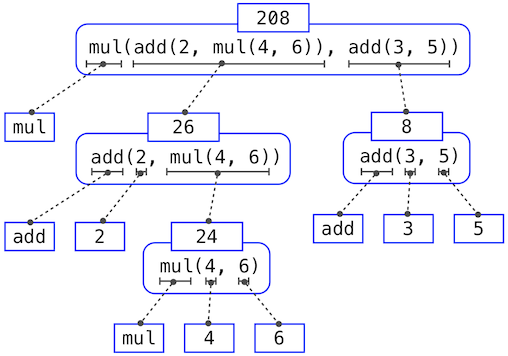

# 1.2 编程元素

> 来源：[1.2   The Elements of Programming](http://www-inst.eecs.berkeley.edu/~cs61a/sp12/book/functions.html#the-elements-of-programming)

> 译者：[飞龙](https://github.com/wizardforcel)

> 协议：[CC BY-NC-SA 4.0](http://creativecommons.org/licenses/by-nc-sa/4.0/)

编程语言是操作计算机来执行任务的手段，它也在我们组织关于过程的想法中，作为一种框架。程序用于在编程社群的成员之间交流这些想法。所以，程序必须为人类阅读而编写，并且仅仅碰巧可以让机器执行。

当我们描述一种语言时，我们应该特别注意这种语言的手段，来将简单的想法组合为更复杂的想法。每个强大的语言都拥有用于完成下列任务的机制：

+ 基本的表达式和语句，它们由语言提供，表示最简单的构建代码块。
+ 组合的手段，复杂的元素由简单的元素通过它来构建，以及
+ 抽象的手段，复杂的元素可以通过它来命名，以及作为整体来操作。

在编程中，我们处理两种元素：函数和数据。（不久之后我们就会探索它们并不是真的非常不同。）不正式地说，数据是我们想要操作的东西，函数描述了操作数据的规则。所以，任何强大的编程语言都应该能描述基本数据和基本函数，并且应该拥有组合和抽象二者的方式。

## 1.2.1 表达式

在实验 Python 解释器之后，我们现在必须重新开始，按照顺序一步步地探索 Python 语言。如果示例看上去很简单，要有耐心 -- 更刺激的东西还在后面。

我们以基本表达式作为开始。一种基本表达式就是数值。更精确地说，是你键入的，由 10 进制数字表示的数值组成的表达式。

```py
>>> 42
42
```

表达式表示的数值也许会和算数运算符组合，来形成复合表达式，解释器会求出它：

```py
>>> -1 - -1
0
>>> 1/2 + 1/4 + 1/8 + 1/16 + 1/32 + 1/64 + 1/128
0.9921875
```

这些算术表达式使用了中缀符号，其中运算符（例如`+`、`-`、`*`、`/`）出现在操作数（数值）中间。Python包含许多方法来形成复合表达式。我们不会尝试立即将它们列举出来，而是在进行中介绍新的表达式形式，以及它们支持的语言特性。

## 1.2.2 调用表达式

最重要的复合表达式就是调用表达式，它在一些参数上调用函数。回忆代数中，函数的数学概念是一些输入值到输出值的映射。例如，`max`函数将它的输入映射到单个输出，输出是输入中的最大值。Python 中的函数不仅仅是输入输出的映射，它表述了计算过程。但是，Python 表示函数的方式和数学中相同。

```py
>>> max(7.5, 9.5)
9.5
```

调用表达式拥有子表达式：运算符在圆括号之前，圆括号包含逗号分隔的操作数。运算符必须是个函数，操作数可以是任何值。这里它们都是数值。当求解这个调用表达式时，我们说`max`函数以参数 7.5 和 9.5 调用，并且返回 9.5。

调用表达式中的参数的顺序极其重要。例如，函数`pow`计算第一个参数的第二个参数次方。

```py
>>> pow(100, 2)
10000
>>> pow(2, 100)
1267650600228229401496703205376
```

函数符号比中缀符号的数学惯例有很多优点。首先，函数可以接受任何数量的参数：

```py
>>> max(1, -2, 3, -4)
3
```

不会产生任何歧义，因为函数的名称永远在参数前面。

其次，函数符号可以以直接的方式扩展为嵌套表达式，其中元素本身是复合表达式。在嵌套的调用表达式中，不像嵌套的中缀表达式，嵌套结构在圆括号中非常明显。

```py
>>> max(min(1, -2), min(pow(3, 5), -4))
-2
```

（理论上）这种嵌套没有任何限制，并且 Python 解释器可以解释任何复杂的表达式。然而，人们可能会被多级嵌套搞晕。你作为程序员的一个重要作用就是构造你自己、你的同伴以及其它在未来可能会阅读你代码的人可以解释的表达式。

最后，数学符号在形式上多种多样：星号表示乘法，上标表示乘方，横杠表示除法，屋顶和侧壁表示开方。这些符号中一些非常难以打出来。但是，所有这些复杂事物可以通过调用表达式的符号来统一。虽然 Python 通过中缀符号（比如`+`和`-`）支持常见的数学运算符，任何运算符都可以表示为带有名字的函数。

## 1.2.3 导入库函数

Python 定义了大量的函数，包括上一节提到的运算符函数，但是通常不能使用它们的名字，这样做是为了避免混乱。反之，它将已知的函数和其它东西组织在模块中，这些模块组成了 Python 库。需要导入它们来使用这些元素。例如，`math`模块提供了大量的常用数学函数：

```py
>>> from math import sqrt, exp
>>> sqrt(256)
16.0
>>> exp(1)
2.718281828459045
```

`operator`模块提供了中缀运算符对应的函数：

```py
>>> from operator import add, sub, mul
>>> add(14, 28)
42
>>> sub(100, mul(7, add(8, 4)))
16
```

`import`语句标明了模块名称（例如`operator`或`math`），之后列出被导入模块的具名属性（例如`sqrt`和`exp`）。

[Python 3 库文档](http://docs.python.org/py3k/library/index.html)列出了定义在每个模块中的函数，例如[数学模块](http://docs.python.org/py3k/library/math.html)。然而，这个文档为了解整个语言的开发者编写。到现在为止，你可能发现使用函数做实验会比阅读文档告诉你更多它的行为。当你更熟悉 Python 语言和词汇时，这个文档就变成了一份有价值的参考来源。

## 1.2.4 名称和环境

编程语言的要素之一是它提供的手段，用于使用名称来引用计算对象。如果一个值被给予了名称，我们就说这个名称绑定到了值上面。

在 Python 中，我们可以使用赋值语句来建立新的绑定，它包含`=`左边的名称和右边的值。

```py
>>> radius = 10
>>> radius
10
>>> 2 * radius
20
```

名称也可以通过`import`语句绑定：

```py
>>> from math import pi
>>> pi * 71 / 223
1.0002380197528042
```

我们也可以在一个语句中将多个值赋给多个名称，其中名称和表达式由逗号分隔：

```py
>>> area, circumference = pi * radius * radius, 2 * pi * radius
>>> area
314.1592653589793
>>> circumference
62.83185307179586
```

`=`符号在 Python（以及许多其它语言）中叫做赋值运算符。赋值是 Python 中的最简单的抽象手段，因为它使我们可以使用最简单的名称来引用复合操作的结果，例如上面计算的`area`。这样，复杂的程序可以由复杂性递增的计算对象一步一步构建，

将名称绑定到值上，以及随后通过名称来检索这些值的可能，意味着解释器必须维护某种内存来跟踪这些名称和值的绑定。这些内存叫做环境。

名称也可以绑定到函数。例如，名称`max`绑定到了我们曾经用过的`max`函数上。函数不像数值，不易于渲染成文本，所以 Python 使用识别描述来代替，当我们打印函数时：

```py
>>> max
<built-in function max>
```

我们可以使用赋值运算符来给现有函数起新的名字：

```py
>>> f = max
>>> f
<built-in function max>
>>> f(3, 4)
4
```

成功的赋值语句可以将名称绑定到新的值：

```py
>>> f = 2
>>> f
2
```

在 Python 中，通过赋值绑定的名称通常叫做变量名称，因为它们在执行程序期间可以绑定到许多不同的值上面。

## 1.2.5 嵌套表达式的求解

我们这章的目标之一是隔离程序化思考相关的问题。作为一个例子，考虑嵌套表达式的求解，解释器自己会遵循一个过程：

为了求出调用表达式，Python 会执行下列事情：

+ 求出运算符和操作数子表达式，之后
+ 在值为操作数子表达式的参数上调用值为运算符子表达式的函数。

这个简单的过程大体上展示了一些过程上的重点。第一步表明为了完成调用表达式的求值过程，我们首先必须求出其它表达式。所以，求值过程本质上是递归的，也就是说，它会调用其自身作为步骤之一。

例如，求出

```py
>>> mul(add(2, mul(4, 6)), add(3, 5))
208
```

需要应用四次求值过程。如果我们将每个需要求解的表达式抽出来，我们可以可视化这一过程的层次结构：



这个示例叫做表达式树。在计算机科学中，树从顶端向下生长。每一点上的对象叫做节点。这里它们是表达式和它们的值。

求出根节点，也就是整个表达式，需要首先求出枝干节点，也就是子表达式。叶子节点（也就是没有子节点的节点）的表达式表示函数或数值。内部节点分为两部分：表示我们想要应用的求值规则的调用表达式，以及表达式的结果。观察这棵树中的求值，我们可以想象操作数的值向上流动，从叶子节点开始，在更高的层上融合。

接下来，观察第一步的重复应用，这会将我们带到需要求值的地方，并不是调用表达式，而是基本表达式，例如数字（比如`2`），以及名称（比如`add`），我们需要规定下列事物来谨慎对待基本的东西：

+ 数字求值为它标明的数值，
+ 名称求值为当前环境中这个名称所关联的值

要注意环境的关键作用是决定表达式中符号的含义。Python 中，在不指定任何环境信息，来提供名称`x`（以及名称`add`）的含义的情况下，谈到这样一个表达式的值没有意义：

```py
>>> add(x, 1)
```

环境提供了求值所发生的上下文，它在我们理解程序执行中起到重要作用。

这个求值过程并不符合所有 Python 代码的求解，仅仅是调用表达式、数字和名称。例如，它并不能处理赋值语句。

```py
>>> x = 3
```

的执行并不返回任何值，也不求解任何参数上的函数，因为赋值的目的是将一个名称绑定到一个值上。通常，语句不会被求值，而是被执行，它们不产生值，但是会改变一些东西。每种语句或表达式都有自己的求值或执行过程，我们会在涉及时逐步介绍。


注：当我们说“数字求值为数值”的时候，我们的实际意思是 Python 解释器将数字求解为数值。Python 的解释器使编程语言具有了这个意义。假设解释器是一个固定的程序，行为总是一致，我们就可以说数字（以及表达式）自己在 Python 程序的上下文中会求解为值。

## 1.2.6 函数图解

当我们继续构建求值的形式模型时，我们会发现解释器内部状态的图解有助于我们跟踪求值过程的发展。这些图解的必要部分是函数的表示。

**纯函数：**具有一些输入（参数）以及返回一些输出（调用结果）的函数。内建函数

```py
>>> abs(-2)
2
```

可以描述为接受输入并产生输出的小型机器。


`abs`是纯函数。纯函数具有一个特性，调用它们时除了返回一个值之外没有其它效果。

**非纯函数：**除了返回一个值之外，调用非纯函数会产生副作用，这会改变解释器或计算机的一些状态。一个普遍的副作用就是在返回值之外生成额外的输出，例如使用`print`函数：


```py
>>> print(-2)
-2
>>> print(1, 2, 3)
1 2 3
```

虽然这些例子中的`print`和`abs`看起来很像，但它们本质上以不同方式工作。`print`的返回值永远是`None`，它是一个 Python 特殊值，表示没有任何东西。Python 交互式解释器并不会自动打印`None`值。这里，`print`自己打印了输出，作为调用中的副作用。


调用`print`的嵌套表达式会凸显出它的非纯特性：

```py
>>> print(print(1), print(2))
1
2
None None
```

如果你发现自己不能预料到这个输出，画出表达式树来弄清为什么这个表达式的求值会产生奇怪的输出。

要当心`print`！它的返回值为`None`，意味着它不应该在赋值语句中用作表达式：

```py
>>> two = print(2)
2
>>> print(two)
None
```

**签名：**不同函数具有不同的允许接受的参数数量。为了跟踪这些必备条件，我们需要以一种展示函数名称和参数名称的方式，画出每个函数。`abs`函数值接受一个叫作`number`的参数，向它提供更多或更少的参数会产生错误。`print`函数可以接受任意数量的参数，所以它渲染为`print(...)`。函数的可接受参数的描述叫做函数的签名。

