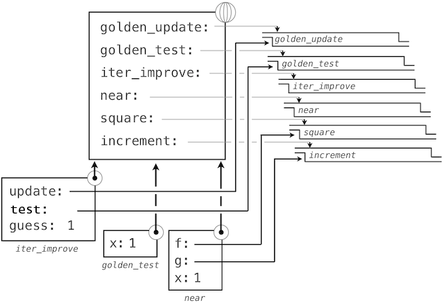

# 1.6 高阶函数

> 来源：[1.6   Higher-Order Functions](http://www-inst.eecs.berkeley.edu/~cs61a/sp12/book/functions.html#higher-order-functions)

> 译者：[飞龙](https://github.com/wizardforcel)

> 协议：[CC BY-NC-SA 4.0](http://creativecommons.org/licenses/by-nc-sa/4.0/)

我们已经看到，函数实际上是描述复合操作的抽象，这些操作不依赖于它们的参数值。在`square`中，

```py
>>> def square(x):
        return x * x
```

我们不会谈论特定数值的平方，而是一个获得任何数值平方的方法。当然，我们可以不定义这个函数来使用它，通过始终编写这样的表达式：

```py
>>> 3 * 3
9
>>> 5 * 5
25
```

并且永远不会显式提及`square`。这种实践适合类似`square`的简单操作。但是对于更加复杂的操作会变得困难。通常，缺少函数定义会对我们非常不利，它会强迫我们始终工作在特定操作的层级上，这在语言中非常原始（这个例子中是乘法），而不是高级操作。我们应该从强大的编程语言索取的东西之一，是通过将名称赋为常用模式来构建抽象的能力，以及之后直接使用抽象的能力。函数提供了这种能力。

我们将会在下个例子中看到，代码中会反复出现一些常见的编程模式，但是使用一些不同函数来实现。这些模式也可以被抽象和给予名称。

为了将特定的通用模式表达为具名概念，我们需要构造可以接受其他函数作为参数的函数，或者将函数作为返回值的函数。操作函数的函数叫做高阶函数。这一节展示了高阶函数可用作强大的抽象机制，极大提升语言的表现力。

## 1.6.1 作为参数的函数

考虑下面三个函数，它们都计算总和。第一个，`sum_naturals`，计算截至`n`的自然数的和：

```py
>>> def sum_naturals(n):
        total, k = 0, 1
        while k <= n:
            total, k = total + k, k + 1
        return total
>>> sum_naturals(100)
5050
```

第二个，`sum_cubes`，计算截至`n`的自然数的立方和：

```py
>>> def sum_cubes(n):
        total, k = 0, 1
        while k <= n:
            total, k = total + pow(k, 3), k + 1
        return total
>>> sum_cubes(100)
25502500
```

第三个，计算这个级数中式子的和：


它会慢慢收敛于`pi`。

```py
>>> def pi_sum(n):
        total, k = 0, 1
        while k <= n:
            total, k = total + 8 / (k * (k + 2)), k + 4
        return total
>>> pi_sum(100)
3.121594652591009
```

这三个函数在背后都具有相同模式。它们大部分相同，只是名字、用于计算被加项的`k`的函数，以及提供`k`的下一个值的函数不同。我们可以通过向相同的模板中填充槽位来生成每个函数：

```py
def <name>(n):
    total, k = 0, 1
    while k <= n:
        total, k = total + <term>(k), <next>(k)
    return total
```

这个通用模板的出现是一个强有力的证据，证明有一个实用抽象正在等着我们表现出来。这些函数的每一个都是式子的求和。作为程序的设计者，我们希望我们的语言足够强大，便于我们编写函数来自我表达求和的概念，而不仅仅是计算特定和的函数。我们可以在 Python 中使用上面展示的通用模板，并且把槽位变成形式参数来轻易完成它。

```py
>>> def summation(n, term, next):
        total, k = 0, 1
        while k <= n:
            total, k = total + term(k), next(k)
        return total
```

要注意`summation`接受上界`n`，以及函数`term`和`next`作为参数。我们可以像任何函数那样使用`summation`，它简洁地表达了求和。

```py
>>> def cube(k):
        return pow(k, 3)
>>> def successor(k):
        return k + 1
>>> def sum_cubes(n):
        return summation(n, cube, successor)
>>> sum_cubes(3)
36
```

使用`identity `函数来返回参数自己，我们就可以对整数求和：

```py
>>> def identity(k):
        return k
>>> def sum_naturals(n):
        return summation(n, identity, successor)
>>> sum_naturals(10)
55
```

我们也可以逐步定义`pi_sum`，使用我们的`summation`抽象来组合组件。

```py
>>> def pi_term(k):
        denominator = k * (k + 2)
        return 8 / denominator
>>> def pi_next(k):
        return k + 4
>>> def pi_sum(n):
        return summation(n, pi_term, pi_next)
>>> pi_sum(1e6)
3.1415906535898936
```

## 1.6.2 作为一般方法的函数

我们引入的用户定义函数作为一种数值运算的抽象模式，便于使它们独立于涉及到的特定数值。使用高阶函数，我们开始寻找更强大的抽象类型：一些函数表达了计算的一般方法，独立于它们调用的特定函数。

尽管函数的意义在概念上扩展了，我们对于如何求解调用表达式的环境模型也优雅地延伸到了高阶函数，没有任何改变。当一个用户定义函数以一些实参调用时，形式参数会在最新的局部帧中绑定实参的值（它们可能是函数）。

考虑下面的例子，它实现了迭代改进的一般方法，并且可以用于计算[黄金比例](http://www.geom.uiuc.edu/~demo5337/s97b/art.htm)。迭代改进算法以一个方程的解的`guess`（推测值）开始。它重复调用`update`函数来改进这个推测值，并且调用`test`来检查是否当前的`guess`“足够接近”所认为的正确值。

```py
>>> def iter_improve(update, test, guess=1):
        while not test(guess):
            guess = update(guess)
        return guess
```

`test`函数通常检查两个函数`f`和`g`在`guess`值上是否彼此接近。测试`f(x)`是否接近于`g(x)`也是计算的一般方法。

```py
>>> def near(x, f, g):
        return approx_eq(f(x), g(x))
```

程序中测试相似性的一个常见方式是将数值差的绝对值与一个微小的公差值相比：

```py
>>> def approx_eq(x, y, tolerance=1e-5):
        return abs(x - y) < tolerance
```

黄金比例，通常叫做`phi`，是经常出现在自然、艺术、和建筑中的数值。它可以通过`iter_improve`使用`golden_update`来计算，并且在它的后继等于它的平方时收敛。

```py
>>> def golden_update(guess):
        return 1/guess + 1
>>> def golden_test(guess):
        return near(guess, square, successor)
```

这里，我们已经向全局帧添加了多个绑定。函数值的描述为了简短而有所删节：


使用`golden_update`和`golden_test`参数来调用`iter_improve`会计算出黄金比例的近似值。

```py
>>> iter_improve(golden_update, golden_test)
1.6180371352785146
```

通过跟踪我们的求值过程的步骤，我们就可以观察结果如何计算。首先，`iter_improve`的局部帧以`update`、`test`和`guess`构建。在`iter_improve`的函数体中，名称`test`绑定到`golden_test`上，它在初始值`guess`上调用。之后，`golden_test`调用`near`，创建第三个局部帧，它将形式参数`f`和`g`绑定到`square`和`successor`上。



完成`near`的求值之后，我们看到`golden_test`为`False`，因为 1 并不非常接近于 2。所以，`while`子句代码组内的求值过程，以及这个机制的过程会重复多次。

这个扩展后的例子展示了计算机科学中两个相关的重要概念。首先，命名和函数允许我们抽象而远离大量的复杂性。当每个函数定义不重要时，由求值过程触发的计算过程是相当复杂的，并且我们甚至不能展示所有东西。其次，基于事实，我们拥有了非常通用的求值过程，小的组件组合在复杂的过程中。理解这个过程便于我们验证和检查我们创建的程序。

像通常一样，我们的新的一般方法`iter_improve`需要测试来检查正确性。黄金比例可以提供这样一个测试，因为它也有一个闭式解，我们可以将它与迭代结果进行比较。

```py
>>> phi = 1/2 + pow(5, 1/2)/2
>>> def near_test():
        assert near(phi, square, successor), 'phi * phi is not near phi + 1'
>>> def iter_improve_test():
        approx_phi = iter_improve(golden_update, golden_test)
        assert approx_eq(phi, approx_phi), 'phi differs from its approximation'
```

**新的环境特性：**高阶函数。

**附加部分：**我们在测试的证明中遗漏了一步。求出公差值`e`的范围，使得如果`tolerance`为`e`的`near(x, square, successor)`值为真，那么使用相同公差值的`approx_eq(phi, x)`值为真。

## 1.6.3 定义函数 III：嵌套定义

上面的例子演示了将函数作为参数传递的能力如何提高了编程语言的表现力。每个通用的概念或方程都能映射为自己的小型函数，这一方式的一个负面效果是全局帧会被小型函数弄乱。另一个问题是我们限制于特定函数的签名：`iter_improve `的`update`参数必须只接受一个参数。Python 中，嵌套函数的定义解决了这些问题，但是需要我们重新修改我们的模型。

让我们考虑一个新问题：计算一个数的平方根。重复调用下面的更新操作会收敛于`x`的平方根：

```py
>>> def average(x, y):
        return (x + y)/2
>>> def sqrt_update(guess, x):
        return average(guess, x/guess)
```

这个带有两个参数的更新函数和`iter_improve`不兼容，并且它只提供了一个介值。我们实际上只关心最后的平方根。这些问题的解决方案是把函数放到其他定义的函数体中。

```py
>>> def square_root(x):
        def update(guess):
            return average(guess, x/guess)
        def test(guess):
            return approx_eq(square(guess), x)
        return iter_improve(update, test)
```

就像局部赋值，局部的`def`语句仅仅影响当前的局部帧。这些函数仅仅当`square_root`求值时在作用域内。和求值过程一致，局部的`def`语句在`square_root`调用之前并不会求值。

**词法作用域。**局部定义的函数也可以访问它们定义所在作用域的名称绑定。这个例子中，`update`引用了名称`x`，它是外层函数`square_root`的一个形参。这种在嵌套函数中共享名称的规则叫做词法作用域。严格来说，内部函数能够访问定义所在环境（而不是调用所在位置）的名称。

我们需要两个对我们环境的扩展来兼容词法作用域。

1.  每个用户定义的函数都有一个关联环境：它的定义所在的环境。
2.  当一个用户定义的函数调用时，它的局部帧扩展于函数所关联的环境。

回到`square_root`，所有函数都在全局环境中定义，所以它们都关联到全局环境，当我们求解`square_root`的前两个子句时，我们创建了关联到局部环境的函数。在

```py
>>> square_root(256)
16.00000000000039
```

的调用中，环境首先添加了`square_root`的局部帧，并且求出`def`语句`update`和`test`（只展示了`update`）：


随后，`update`的名称解析到这个新定义的函数上，它是向`iter_improve`传入的参数。在`iter_improve`的函数体中，我们必须以初始值 1 调用`update`函数。最后的这个调用以一开始只含有`g`的局部帧创建了`update`的环境，但是之前的`square_root`帧上仍旧含有`x`的绑定。


这个求值过程中，最重要的部分是函数所关联的环境变成了局部帧，它是函数求值的地方。这个改变在图中以蓝色箭头高亮。

以这种方式，`update`的函数体能够解析名称`x`。所以我们意识到了词法作用域的两个关键优势。

+ 局部函数的名称并不影响定义所在函数外部的名称，因为局部函数的名称绑定到了定义处的当前局部环境中，而不是全局环境。
+ 局部函数可以访问外层函数的环境。这是因为局部函数的函数体的求值环境扩展于定义处的求值环境。

`update`函数自带了一些数据：也就是在定义处环境中的数据。因为它以这种方式封装信息，局部定义的函数通常叫做闭包。

**新的环境特性：**局部函数定义。

## 1.6.4 作为返回值的函数

我们的程序可以通过创建返回值是它们本身的函数，获得更高的表现力。带有词法作用域的编程语言的一个重要特性就是，局部定义函数在它们返回时仍旧持有所关联的环境。下面的例子展示了这一特性的作用。

在定义了许多简单函数之后，`composition`是包含在我们的编程语言中的自然组合法。也就是说，提供两个函数`f(x)`和`g(x)`，我们可能希望定义`h(x) = f(g(x))`。我们可以使用现有工具来定义复合函数：

```py
>>> def compose1(f, g):
        def h(x):
            return f(g(x))
        return h
>>> add_one_and_square = compose1(square, successor)
>>> add_one_and_square(12)
169
```

`compose1`中的`1`表明复合函数和返回值都只接受一个参数。这种命名惯例并不由解释器强制，`1`只是函数名称的一部分。

这里，我们开始观察我们在计算的复杂模型中投入的回报。我们的环境模型不需要任何修改就能支持以这种方式返回函数的能力。

## 1.6.5 Lambda 表达式

目前为止，每次我们打算定义新的函数时，我们都会给它一个名称。但是对于其它类型的表达式，我们不需要将一个间接产物关联到名称上。也就是说，我们可以计算`a*b + c*d`，而不需要给子表达式`a*b`或`c*d`，或者整个表达式来命名。Python 中，我们可以使用 Lambda 表达式凭空创建函数，它会求值为匿名函数。Lambda 表达式是函数体具有单个返回表达式的函数，不允许出现赋值和控制语句。

Lambda 表达式十分受限：它们仅仅可用于简单的单行函数，求解和返回一个表达式。在它们适用的特殊情形中，Lambda 表达式具有强大的表现力。

```py
>>> def compose1(f,g):
        return lambda x: f(g(x))
```

我们可以通过构造相应的英文语句来理解 Lambda 表达式：

```py
     lambda            x            :          f(g(x))
"A function that    takes x    and returns     f(g(x))"
```

一些程序员发现使用 Lambda 表达式作为匿名函数非常简短和直接。但是，复合的 Lambda 表达式非常难以辨认，尽管它们很简洁。下面的定义是是正确的，但是许多程序员不能很快地理解它：

```py
>>> compose1 = lambda f,g: lambda x: f(g(x))
```

通常，Python 的代码风格倾向于显式的`def`语句而不是 Lambda 表达式，但是允许它们在简单函数作为参数或返回值的情况下使用。

这种风格规范不是准则，你可以想怎么写就怎么写，但是，在你编写程序时，要考虑某一天可能会阅读你的程序的人们。如果你可以让你的程序更易于理解，你就帮了人们一个忙。

Lambda 的术语是一个历史的偶然结果，来源于手写的数学符号和早期打字系统限制的不兼容。

> 使用 lambda 来引入过程或函数看起来是不正当的。这个符号要追溯到 Alonzo Church，他在 20 世纪 30 年代开始使用“帽子”符号；他把平方函数记为`ŷ . y × y`。但是失败的打字员将这个帽子移到了参数左边，并且把它改成了大写的 lambda：`Λy . y × y`；之后大写的 lambda 就变成了小写，现在我们就会在数学书里看到`λy . y × y`，以及在 Lisp 里看到`(lambda (y) (* y y))`。

> -- Peter Norvig (norvig.com/lispy2.html)

尽管它的词源不同寻常，Lambda 表达式和函数调用相应的形式语言，以及 Lambda 演算都成为了计算机科学概念的基础，并在 Python 编程社区广泛传播。当我们学习解释器的设计时，我们将会在第三章中重新碰到这个话题。

## 1.6.6 示例：牛顿法

最后的扩展示例展示了函数值、局部定义和 Lambda 表达式如何一起工作来简明地表达通常的概念。

牛顿法是一个传统的迭代方法，用于寻找使数学函数返回值为零的参数。这些值叫做一元数学函数的根。寻找一个函数的根通常等价于求解一个相关的数学方程。

+ 16 的平方根是满足`square(x) - 16 = 0`的`x`值。
+ 以 2 为底 32 的对数（例如 2 与某个指数的幂为 32）是满足`pow(2, x) - 32 = 0`的`x`值。

所以，求根的通用方法会向我们提供算法来计算平方根和对数。而且，我们想要计算根的等式只包含简单操作：乘法和乘方。

在我们继续之前有个注解：我们知道如何计算平方根和对数，这个事实很容易当做自然的事情。并不只是 Python，你的手机和计算机，可能甚至你的手表都可以为你做这件事。但是，学习计算机科学的一部分是弄懂这些数如何计算，而且，这里展示的通用方法可以用于求解大量方程，而不仅仅是内建于 Python 的东西。

在开始理解牛顿法之前，我们可以开始编程了。这就是函数抽象的威力。我们简单地将之前的语句翻译成代码：

```py
>>> def square_root(a):
        return find_root(lambda x: square(x) - a)
>>> def logarithm(a, base=2):
        return find_root(lambda x: pow(base, x) - a)
```

当然，在我们定义`find_root`之前，现在还不能调用任何函数，所以我们需要理解牛顿法如何工作。

牛顿法也是一个迭代改进算法：它会改进任何可导函数的根的推测值。要注意我们感兴趣的两个函数都是平滑的。对于

+ `f(x) = square(x) - 16`（细线）
+ `f(x) = pow(2, x) - 32`（粗线）

在二维平面上画出`x`对`f(x)`的图像，它展示了两个函数都产生了光滑的曲线，它们在某个点穿过了 0。


由于它们是光滑的（可导的），这些曲线可以通过任何点上的直线来近似。牛顿法根据这些线性的近似值来寻找函数的根。

想象经过点`(x, f(x))`的一条直线，它与函数`f(x)`的曲线在这一点的斜率相同。这样的直线叫做切线，它的斜率叫做`f`在`x`上的导数。

这条直线的斜率是函数值改变量与函数参数改变量的比值。所以，按照`f(x)`除以这个斜率来平移`x`，就会得到切线到达 0 时的`x`值。


我们的牛顿更新操作表达了跟随这条切线到零的计算过程。我们通过在非常小的区间上计算函数斜率来近似得到函数的导数。

```py
>>> def approx_derivative(f, x, delta=1e-5):
        df = f(x + delta) - f(x)
        return df/delta
>>> def newton_update(f):
        def update(x):
            return x - f(x) / approx_derivative(f, x)
        return update
```

最后，我们可以定义基于`newton_update`（我们的迭代改进算法）的`find_root`函数，以及一个测试来观察`f(x)`是否接近于 0。我们提供了一个较大的初始推测值来提升`logarithm`的性能。

```py
>>> def find_root(f, initial_guess=10):
        def test(x):
            return approx_eq(f(x), 0)
        return iter_improve(newton_update(f), test, initial_guess)
>>> square_root(16)
4.000000000026422
>>> logarithm(32, 2)
5.000000094858201
```

当你实验牛顿法时，要注意它不总是收敛的。`iter_improve`的初始推测值必须足够接近于根，而且函数必须满足各种条件。虽然具有这些缺陷，牛顿法是一个用于解决微分方程的强大的通用计算方法。实际上，非常快速的对数算法和大整数除法也采用这个技巧的变体。

## 1.6.7 抽象和一等函数

这一节的开始，我们以观察用户定义函数作为关键的抽象技巧，因为它们让我们能够将计算的通用方法表达为编程语言中的显式元素。现在我们已经看到了高阶函数如何让我们操作这些通用方法来进一步创建抽象。

作为程序员，我们应该留意识别程序中低级抽象的机会，在它们之上构建，并泛化它们来创建更加强大的抽象。这并不是说，一个人应该总是尽可能以最抽象的方式来编程；专家级程序员知道如何选择合适于他们任务的抽象级别。但是能够基于这些抽象来思考，以便我们在新的上下文中能使用它们十分重要。高阶函数的重要性是，它允许我们更加明显地将这些抽象表达为编程语言中的元素，使它们能够处理其它的计算元素。

通常，编程语言会限制操作计算元素的途径。带有最少限制的元素被称为具有一等地位。一些一等元素的“权利和特权”是：

1.  它们可以绑定到名称。
2.  它们可以作为参数向函数传递。
3.  它们可以作为函数的返回值返回。
4.  它们可以包含在数据结构中。

Python 总是给予函数一等地位，所产生的表现力的收益是巨大的。另一方面，控制结构不能做到：你不能像使用`sum`那样将`if`传给一个函数。

## 1.6.8 函数装饰器

Python 提供了特殊的语法，将高阶函数用作执行`def`语句的一部分，叫做装饰器。


```py
>>> def trace1(fn):
        def wrapped(x):
            print('-> ', fn, '(', x, ')')
            return fn(x)
        return wrapped
>>> @trace1
    def triple(x):
        return 3 * x
>>> triple(12)
->  <function triple at 0x102a39848> ( 12 )
36
```

这个例子中，定义了高阶函数`trace1`，它返回一个函数，这个函数在调用它的参数之前执行`print`语句来输出参数。`triple`的`def`语句拥有一个注解，`@trace1`，它会影响`def`的执行规则。像通常一样，函数`triple`被创建了，但是，`triple`的名称并没有绑定到这个函数上，而是绑定到了在新定义的函数`triple`上调用`trace1`的返回函数值上。在代码中，这个装饰器等价于：

```py
>>> def triple(x):
        return 3 * x
>>> triple = trace1(triple)
```

**附加部分：**实际规则是，装饰器符号`@`可以放在表达式前面（`@trace1`仅仅是一个简单的表达式，由单一名称组成）。任何产生合适的值的表达式都可以。例如，使用合适的值，你可以定义装饰器`check_range`，使用`@check_range(1, 10)`来装饰函数定义，这会检查函数的结果来确保它们是 1 到 10 的整数。调用`check_range(1,10)`会返回一个函数，之后它会用在新定义的函数上，在新定义的函数绑定到`def`语句中的名称之前。感兴趣的同学可以阅读 Ariel Ortiz 编写的[一篇装饰器的简短教程](http://programmingbits.pythonblogs.com/27_programmingbits/archive/50_function_decorators.html)来了解更多的例子。
