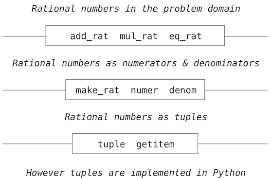

# 2.2 数据抽象

> 来源：[2.2   Data Abstraction](http://www-inst.eecs.berkeley.edu/~cs61a/sp12/book/objects.html#introduction)

> 译者：[飞龙](https://github.com/wizardforcel)

> 协议：[CC BY-NC-SA 4.0](http://creativecommons.org/licenses/by-nc-sa/4.0/)

由于我们希望在程序中表达世界中的大量事物，我们发现它们的大多数都具有复合结构。日期是年月日，地理位置是精度和纬度。为了表示位置，我们希望程序语言具有将精度和纬度“粘合”为一对数据的能力 -- 也就是一个复合数据结构 -- 使我们的程序能够以一种方式操作数据，将位置看做单个概念单元，它拥有两个部分。

复合数据的使用也让我们增加程序的模块性。如果我们可以直接将地理位置看做对象来操作，我们就可以将程序的各个部分分离，它们根据这些值如何表示来从本质上处理这些值。将某个部分从程序中分离的一般技巧是一种叫做数据抽象的强大的设计方法论。这个部分用于处理数据表示，而程序用于操作数据。数据抽象使程序更易于设计、维护和修改。

数据抽象的特征类似于函数抽象。当我们创建函数抽象时，函数如何实现的细节被隐藏了，而且特定的函数本身可以被任何具有相同行为的函数替换。换句话说，我们可以构造抽象来使函数的使用方式和函数的实现细节分离。与之相似，数据抽象是一种方法论，使我们将复合数据对象的使用细节与它的构造方式隔离。

数据抽象的基本概念是构造操作抽象数据的程序。也就是说，我们的程序应该以一种方式来使用数据，对数据做出尽可能少的假设。同时，需要定义具体的数据表示，独立于使用数据的程序。我们系统中这两部分的接口是一系列函数，叫做选择器和构造器，它们基于具体表示实现了抽象数据。为了演示这个技巧，我们需要考虑如何设计一系列函数来操作有理数。

当你阅读下一节时，要记住当今编写的多数 Python 代码使用了非常高级的抽象数据类型，它们内建于语言中，比如类、字典和列表。由于我们正在了解这些抽象的工作原理，我们自己不能使用它们。所以，我们会编写一些不那么 Python 化的代码 -- 它并不是在语言中实现我们的概念的通常方式。但是，我们所编写的代码出于教育目的，它展示了这些抽象如何构建。要记住计算机科学并不只是学习如何使用编程语言，也学习它们的工作原理。

## 2.2.1 示例：有理数的算术

有理数可表示为整数的比值，并且它组成了实数的一个重要子类。类似于`1/3`或者`17/29`的有理数通常可编写为：

```
<numerator>/<denominator>
```

其中，`<numerator>`和`<denominator>`都是值为整数的占位符。有理数的值需要两部分来描述。

有理数在计算机科学中很重要，因为它们就像整数那样，可以准确表示。无理数（比如`pi` 或者 `e` 或者 `sqrt(2)`）会使用有限的二元展开代替为近似值。所以在原则上，有理数的处理应该让我们避免算术中的近似误差。

但是，一旦我们真正将分子与分母相除，我们就会只剩下截断的小数近似值：

```py
>>> 1/3
0.3333333333333333
```

当我们开始执行测试时，这个近似值的问题就会出现：

```py
>>> 1/3 == 0.333333333333333300000  # Beware of approximations
True
```

计算机如何将实数近似为定长的小数扩展，是另一门课的话题。这里的重要概念是，通过将有理数表示为整数的比值，我们能够完全避免近似问题。所以出于精确，我们希望将分子和分母分离，但是将它们看做一个单元。

我们从函数抽象中了解到，我们可以在了解某些部分的实现之前开始编出东西来。让我们一开始假设我们已经拥有一种从分子和分母中构造有理数的方式。我们也假设，给定一个有理数，我们都有办法来提取（或选中）它的分子和分母。让我们进一步假设，构造器和选择器以下面三个函数来提供：

+ `make_rat(n, d)`返回分子为`n`和分母为`d`的有理数。
+ `numer(x)`返回有理数`x`的分子。
+ `denom(x)`返回有理数`x`的分母。

我们在这里正在使用一个强大的合成策略：心想事成。我们并没有说有理数如何表示，或者`numer`、`denom`和`make_rat`如何实现。即使这样，如果我们拥有了这三个函数，我们就可以执行加法、乘法，以及测试有理数的相等性，通过调用它们：

```py
>>> def add_rat(x, y):
        nx, dx = numer(x), denom(x)
        ny, dy = numer(y), denom(y)
        return make_rat(nx * dy + ny * dx, dx * dy)
>>> def mul_rat(x, y):
        return make_rat(numer(x) * numer(y), denom(x) * denom(y))
>>> def eq_rat(x, y):
        return numer(x) * denom(y) == numer(y) * denom(x)
```

现在我们拥有了由选择器函数`numer`和`denom`，以及构造器函数`make_rat`定义的有理数操作。但是我们还没有定义这些函数。我们需要以某种方式来将分子和分母粘合为一个单元。

## 2.2.2 元组

为了实现我们的数据抽象的具体层面，Python 提供了一种复合数据结构叫做`tuple`，它可以由逗号分隔的值来构造。虽然并不是严格要求，圆括号通常在元组周围。

```py
>>> (1, 2)
(1, 2)
```

元组的元素可以由两种方式解构。第一种是我们熟悉的多重赋值：

```py
>>> pair = (1, 2)
>>> pair
(1, 2)
>>> x, y = pair
>>> x
1
>>> y
2
```

实际上，多重赋值的本质是创建和解构元组。

访问元组元素的第二种方式是通过下标运算符，写作方括号：

```py
>>> pair[0]
1
>>> pair[1]
2
```

Python 中的元组（以及多数其它编程语言中的序列）下标都以 0 开始，也就是说，下标 0 表示第一个元素，下标 1 表示第二个元素，以此类推。我们对这个下标惯例的直觉是，下标表示一个元素距离元组开头有多远。

与元素选择操作等价的函数叫做`__getitem__`，它也使用位置在元组中选择元素，位置的下标以 0 开始。

```py
>>> from operator import getitem
>>> getitem(pair, 0)
1
```

元素是原始类型，也就是说 Python 的内建运算符可以操作它们。我们不久之后再来看元素的完整特性。现在，我们只对元组如何作为胶水来实现抽象数据类型感兴趣。

**表示有理数。**元素提供了一个自然的方式来将有理数实现为一对整数：分子和分母。我们可以通过操作二元组来实现我们的有理数构造器和选择器函数。

```py
>>> def make_rat(n, d):
        return (n, d)
>>> def numer(x):
        return getitem(x, 0)
>>> def denom(x):
        return getitem(x, 1)
```

用于打印有理数的函数完成了我们对抽象数据结构的实现。

```py
>>> def str_rat(x):
        """Return a string 'n/d' for numerator n and denominator d."""
        return '{0}/{1}'.format(numer(x), denom(x))
```

将它与我们之前定义的算术运算放在一起，我们可以使用我们定义的函数来操作有理数了。

```py
>>> half = make_rat(1, 2)
>>> str_rat(half)
'1/2'
>>> third = make_rat(1, 3)
>>> str_rat(mul_rat(half, third))
'1/6'
>>> str_rat(add_rat(third, third))
'6/9'
```

就像最后的例子所展示的那样，我们的有理数实现并没有将有理数化为最简。我们可以通过修改`make_rat`来补救。如果我们拥有用于计算两个整数的最大公约数的函数，我们可以在构造一对整数之前将分子和分母化为最简。这可以使用许多实用工具，例如 Python 库中的现存函数。

```py
>>> from fractions import gcd
>>> def make_rat(n, d):
        g = gcd(n, d)
        return (n//g, d//g)
```

双斜杠运算符`//`表示整数除法，它会向下取整除法结果的小数部分。由于我们知道`g`能整除`n`和`d`，整数除法正好适用于这里。现在我们的

```py
>>> str_rat(add_rat(third, third))
'2/3'
```

符合要求。这个修改只通过修改构造器来完成，并没有修改任何实现实际算术运算的函数。

**扩展阅读。**上面的`str_rat`实现使用了格式化字符串，它包含了值的占位符。如何使用格式化字符串和`format`方法的细节请见 Dive Into Python 3 的[格式化字符串](http://diveintopython3.ep.io/strings.html#formatting-strings)一节。

## 2.2.3 抽象界限

在以更多复合数据和数据抽象的例子继续之前，让我们思考一些由有理数示例产生的问题。我们使用构造器`make_rat`和选择器`numer`和`denom`定义了操作。通常，数据抽象的底层概念是，基于某个值的类型的操作如何表达，为这个值的类型确定一组基本的操作。之后使用这些操作来操作数据。

我们可以将有理数系统想象为一系列层级。



平行线表示隔离系统不同层级的界限。每一层上，界限分离了使用数据抽象的函数（上面）和实现数据抽象的函数（下面）。使用有理数的程序仅仅通过算术函数来操作它们：`add_rat`、`mul_rat`和`eq_rat`。相应地，这些函数仅仅由构造器和选择器`make_rat`、`numer`和`and denom`来实现，它们本身由元组实现。元组如何实现的字节和其它层级没有关系，只要元组支持选择器和构造器的实现。

每一层上，盒子中的函数强制划分了抽象的边界，因为它们仅仅依赖于上层的表现（通过使用）和底层的实现（通过定义）。这样，抽象界限可以表现为一系列函数。

抽象界限具有许多好处。一个好处就是，它们使程序更易于维护和修改。很少的函数依赖于特定的表现，当一个人希望修改表现时，不需要做很多修改。

## 2.2.4 数据属性

我们通过实现算术运算来开始实现有理数，实现为这三个非特定函数：`make_rat`、`numer`和`denom`。这里，我们可以认为已经定义了数据对象 -- 分子、分母和有理数 -- 上的运算，它们的行为由这三个函数规定。

但是数据意味着什么？我们还不能说“提供的选择器和构造器实现了任何东西”。我们需要保证这些函数一起规定了正确的行为。也就是说，如果我们从整数`n`和`d`中构造了有理数`x`，那么`numer(x)/denom(x)`应该等于`n/d`。

通常，我们可以将抽象数据类型当做一些选择器和构造器的集合，并带有一些行为条件。只要满足了行为条件（比如上面的除法特性），这些函数就组成了数据类型的有效表示。

这个观点可以用在其他数据类型上，例如我们为实现有理数而使用的二元组。我们实际上不会谈论元组是什么，而是谈论由语言提供的，用于操作和创建元组的运算符。我们现在可以描述二元组的行为条件，二元组通常叫做偶对，在表示有理数的问题中有所涉及。

为了实现有理数，我们需要一种两个整数的粘合形式，它具有下列行为：

+ 如果一个偶对`p`由`x`和`y`构造，那么`getitem_pair(p, 0)`返回`x`，`getitem_pair(p, 1)`返回`y`。

我们可以实现`make_pair`和`getitem_pair`，它们和元组一样满足这个描述：

```py
>>> def make_pair(x, y):
        """Return a function that behaves like a pair."""
        def dispatch(m):
            if m == 0:
                return x
            elif m == 1:
                return y
        return dispatch
>>> def getitem_pair(p, i):
        """Return the element at index i of pair p."""
        return p(i)
```

使用这个实现，我们可以创建和操作偶对：

```py
>>> p = make_pair(1, 2)
>>> getitem_pair(p, 0)
1
>>> getitem_pair(p, 1)
2
```

这个函数的用法不同于任何直观上的，数据应该是什么的概念。而且，这些函数满足于在我们的程序中表示复合数据。

需要注意的微妙的一点是，由`make_pair`返回的值是叫做`dispatch`的函数，它接受参数`m`并返回`x`或`y`。之后，`getitem_pair`调用了这个函数来获取合适的值。我们在这一章中会多次返回这个调度函数的话题。

这个偶对的函数表示并不是 Python 实际的工作机制（元组实现得更直接，出于性能因素），但是它可以以这种方式工作。这个函数表示虽然不是很明显，但是是一种足够完美来表示偶对的方式，因为它满足了偶对唯一需要满足的条件。这个例子也表明，将函数当做值来操作的能力，提供给我们表示复合数据的能力。
