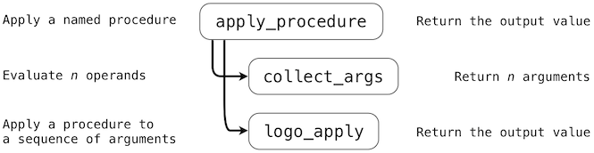

# 3.6 抽象语言的解释器

> 来源：[3.6   Interpreters for Languages with Abstraction](http://www-inst.eecs.berkeley.edu/~cs61a/sp12/book/interpretation.html#interpreters-for-languages-with-abstraction)

> 译者：[飞龙](https://github.com/wizardforcel)

> 协议：[CC BY-NC-SA 4.0](http://creativecommons.org/licenses/by-nc-sa/4.0/)

计算器语言提供了一种手段，来组合一些嵌套的调用表达式。然而，我们却没有办法定义新的运算符，将值赋给名称，或者表达通用的计算方法。总之，计算器并不以任何方式支持抽象。所以，它并不是特别强大或通用的编程语言。我们现在转到定义一种通用编程语言的任务中，这门语言通过将名称绑定到值以及定义新的操作来支持抽象。

我们并不是进一步扩展简单的计算器语言，而是重新开始，并且为 Logo 语言开发解释器。Logo 并不是为这门课发明的语言，而是一种经典的命令式语言，拥有许多解释器实现和自己的开发者社区。

上一章，我们将完整的解释器表示为 Python 源码，这一章使用描述性的方式。某个配套工程需要你通过构建完整的 Logo 函数式解释器来实现这里展示的概念。

## 3.6.1 Scheme 语言

Scheme 是 Lisp 的一种方言，Lisp 是现在仍在广泛使用的第二老（在 Fortran 之后）的编程语言。Scheme首次在 1975 年由 Gerald Sussman 和 Guy Steele 描述。Revised(4) Report on the Algorithmic Language Scheme 的引言中写道：

> 编程语言不应该通过堆砌特性，而是应该通过移除那些使额外特性变得必要的缺点和限制来设计。Scheme 表明，用于组成表达式的非常少量的规则，在没有组合方式的限制的情况下，足以组成实用并且高效的编程语言，它足够灵活，在使用中可以支持多数当今的主流编程范式。

我们将这个报告推荐给你作为 Scheme 语言的详细参考。我们这里只会涉及重点。下面的描述中，我们会用到报告中的例子。

虽然 Scheme 非常简单，但它是一种真正的编程语言，在许多地方都类似于 Python，但是“语法糖[1]”会尽量少。基本上，所有运算符都是函数调用的形式。这里我们会描述完整的 Scheme 语言的在报告中描述的可展示的子集。

> [1] 非常遗憾，这对于 Scheme 语言的最新版本并不成立，就像 Revised(6) Report 中的那样。所以这里我们仅仅针对之前的版本。

Scheme 有多种可用的实现，它们添加了额外的过程。在 UCB，我们使用[Stk 解释器的一个修改版](http://inst.eecs.berkeley.edu/~scheme/)，它也在我们的教学服务器上以`stk`提供。不幸的是，它并不严格遵守正式规范，但它可用于我们的目的。

**使用解释器。**就像 Python 解释器[2]那样，向 Stk 键入的表达式会由“读取-求值-打印”循环求值并打印：

```scheme
>>> 3
3
>>> (- (/ (* (+ 3 7 10) (- 1000 8)) 992) 17)
3
>>> (define (fib n) (if (< n 2) n (+ (fib (- n 2)) (fib (- n 1)))))
fib
>>> '(1 (7 19))
(1 (7 19))
```

> [2] 在我们的例子中，我们使用了和 Python 相同的符号`>>>`和`...`，来表示解释器的输入行，和非前缀输出的行。实际上，Scheme 解释器使用不同的提示符。例如，Stk 以`STk>`来提示，并且不提示连续行。然而 Python 的惯例使输入和输出更加清晰。

**Scheme 中的值。**Scheme 中的值通常与 Python 对应。

布尔值

真值和假值，使用`#t`和`#f`来表示。Scheme 中唯一的假值（按照 Python 的含义）就是`#f`。

数值

这包括任意精度的整数、有理数、复数，和“不精确”（通常是浮点）数值。整数可用标准的十进制表示，或者通过在数字之前添加`#o`（八进制）、`#x`（十六进制）或`#b`（二进制），以其他进制表示。

符号

符号是一种字符串，但是不被引号包围。有效的字符包括字母、数字和：

```
!  $  %  &  *  /  :  <  = >  ?  ^  _  ~  +  -  .  @
```

在使用`read`函数输入时，它会读取 Scheme 表达式（也是解释器用于输入程序文本的东西），不区分符号中的大小写（在STk 实现中会转为小写）。两个带有相同表示的符号表示同一对象（并不是两个碰巧拥有相同内容的对象）。

偶对和列表

偶对是含有两个（任意类型）成员的对象，叫做它的`car`和`cdr`。`car`为`A`且`cdr`为`B`的偶对可表示为`(A . B)`。偶对（就像 Python 中的元组）可以表示列表、树和任意的层次结构。

标准的 Scheme 列表包含空的列表值（记为`()`），或者包含一个偶对，它的`car`是列表第一个元素，`cdr`是列表的剩余部分。所以，包含整数`1, 2, 3`的列表可表示为：

```scheme
(1 . (2 . (3 . ())))
```

列表无处不在，Scheme 允许我们将`(a . ())`缩略为`(a)`，将`(a . (b ...))`缩略为`(a b ...)`。所以，上面的列表通常写为：

```scheme
(1 2 3)
```

过程（函数）

就像 Python 中一样，过程（或函数）值表示一些计算，它们可以通过向函数提供参数来调用。过程要么是原始的，由 Scheme 的运行时系统提供，要么从 Scheme 表达式和环境构造（就像 Python 中那样）。没有用于函数值的直接表示，但是有一些绑定到基本函数的预定义标识符，也有一些 Scheme 表达式，在求值时会产生新的过程值。

其它类型

Scheme 也支持字符和字符串（类似 Python 的字符串，除了 Scheme 区分字符和字符串），以及向量（就像 Python 的列表）。

**程序表示。**就像其它 Lisp 版本，Scheme 的数据值也用于表示程序。例如，下面的 Scheme 列表：

```scheme
(+ x (* 10 y))
```

取决于如何使用，可表示为三个元素的列表（它的最后一个元素也是三个元素的列表），或者表达为用于计算`x+10y`的 Scheme 表达式。为了将 Scheme 值求值为程序，我们需要考虑值的类型，并按以下步骤求值：

+ 整数、布尔值、字符、字符串和向量都求值为它们自己。所以，表达式`5`求值为 5。
+ 纯符号看做变量。它们的值由当前被求值环境来决定，就像 Python 那样。
+ 非空列表以两种方式解释，取决于它们的第一个成员：
  + 如果第一个成员是特殊形式的符号（在下面描述），求值由这个特殊形式的规则执行。
  + 所有其他情况（叫做组合）中，列表的成员会以非特定的顺序（递归）求值。第一个成员必须是函数值。这个值会被调用，以列表中剩余成员的值作为参数。
+ 其他 Scheme 值（特别是，不是列表的偶对）在程序中是错误的。

例如：

```scheme
>>> 5              ; A literal.
5
>>> (define x 3)   ; A special form that creates a binding for symbol
x                   ; x.
>>> (+ 3 (* 10 x)) ; A combination.  Symbol + is bound to the primitive
33                  ; add function and * to primitive multiply.
```

**基本的特殊形式。**特殊形式将东西表示为 Python 中的控制结构、函数调用或者类的定义：在调用时，这些结构不会简单地立即求值。

首先，一些通用的结构以这种形式使用：

`EXPR-SEQ`

只是表达式的序列，例如：

```scheme
(+ 3 2) x (* y z)
```

当它出现在下面的定义中时，它指代从左到右求值的表达式序列，序列中最后一个表达式的值就是它的值。

`BODY`

一些结构拥有“主体”，它们是 `EXPR-SEQ`，就像上面一样，可能由一个或多个定义处理。它们的值就是 `EXPR-SEQ` 的值。这些定义的解释请见内部定义一节。

下面是这些特殊形式的代表性子集：

定义

定义可以出现在程序的顶层（也就是不包含在其它结构中）。

`(define SYM EXPR)`

求出`EXPR`并在当前环境将其值绑定到符号`SYM`上。

`(define (SYM ARGUMENTS) BODY)`

等价于`(define SYM (lambda (ARGUMENTS) BODY))`。

`(lambda (ARGUMENTS) BODY)`

求值为函数。`ARGUMENTS `通常为（可能非空的）不同符号的列表，向函数提供参数名称，并且表明它们的数量。`ARGUMENTS`也可能具有如下形式：

```scheme
(sym1 sym2 ... symn . symr)
```

（也就是说，列表的末尾并不像普通列表那样是空的，最后的`cdr`是个符号。）这种情况下，`symr`会绑定到列表的尾后参数值（后面的第 n+1 个参数）。

当产生的函数被调用时，`ARGUMENTS`在一个新的环境中绑定到形参的值上，新的环境扩展自`lambda`表达式求值的环境（就像 Python 那样）。之后`BODY`会被求值，它的值会作为调用的值返回。

`(if COND-EXPR TRUE-EXPR OPTIONAL-FALSE-EXPR)`

求出`COND-EXPR`，如果它的值不是`#f`，那么求出`TRUE-EXPR`，结果会作为`if`的值。如果`COND-EXPR`值为`#f`而且`OPTIONAL-FALSE-EXPR`存在，它会被求值为并作为`if`的值。如果它不存在，`if`值是未定义的。

`(set! SYMBOL EXPR)`

求出`EXPR`使用该值替换`SYMBOL `的绑定。`SYMBOL `必须已经绑定，否则会出现错误。和 Python 的默认情况不同，它会在定义它的第一个环境帧上替换绑定，而不总是最深处的帧。

`(quote EXPR)` 或 `'EXPR`

将 Scheme 数据结构用于程序表示的一个问题，是需要一种方式来表示打算被求值的程序文本。`quote`形式求值为`EXPR`自身，而不进行进一步的求值（替代的形式使用前导的单引号，由 Scheme 表达式读取器转换为第一种形式）。例如：

```scheme
>>> (+ 1 2)
3
>>> '(+ 1 2)
(+ 1 2)
>>> (define x 3)
x
>>> x
3
>>> (quote x)
x
>>> '5
5
>>> (quote 'x)
(quote x)
```

**派生的特殊形式**

派生结构时可以翻译为基本结构的结构。它们的目的是让程序对于读取器更加简洁可读。在 Scheme 中：

`(begin EXPR-SEQ)`

简单地求值并产生`EXPR-SEQ`的值。这个结构是个简单的方式，用于在需要单个表达式的上下文中执行序列或表达式。

`(and EXPR1 EXPR2 ...)`

每个`EXPR`从左到右执行，直到碰到了`#f`，或遍历完`EXPRs`。值是最后求值的`EXPR`，如果`EXPRs`列表为空，那么值为`#t`。例如：

```scheme
>>> (and (= 2 2) (> 2 1))
#t
>>> (and (< 2 2) (> 2 1))
#f
>>> (and (= 2 2) '(a b))
(a b)
>>> (and)
#t
```

`(or EXPR1 EXPR2 ...)`

每个`EXPR`从左到右求值，直到碰到了不为`#f`的值，或遍历完`EXPRs`。值为最后求值的`EXPR`，如`EXPRs`列表为空，那么值为`#f`。例如：

```scheme
>>> (or (= 2 2) (> 2 3))
#t
>>> (or (= 2 2) '(a b))
#t
>>> (or (> 2 2) '(a b))
(a b)
>>> (or (> 2 2) (> 2 3))
#f
>>> (or)
#f
```

`(cond CLAUSE1 CLAUSE2 ...)`

每个`CLAUSEi`都依次处理，直到其中一个处理成功，它的值就是`cond`的值。如果没有子句处理成功，值是未定义的。每个子句都有三种可能的形式。

如果`TEST-EXPR `求值为不为`#f`的值，`(TEST-EXPR EXPR-SEQ)`形式执行成功。这种情况下，它会求出`EXPR-SEQ`并产生它的值。`EXPR-SEQ`可以不写，这种情况下值为`TEST-EXPR`本身。

最后一个子句可为`(else EXPR-SEQ)`的形式，它等价于`(#t EXPR-SEQ)`。

最后，如果`(TEST_EXPR => EXPR)`的形式在`TEST_EXPR`求值为不为`#f`的值（叫做`V`）时求值成功。如果求值成功，`cond`结构的值是由`(EXPR V)`返回的值。也就是说，`EXPR`必须求值为单参数的函数，在`TEST_EXPR`的值上调用。

例如：

```scheme
>>> (cond ((> 3 2) 'greater)
...        ((< 3 2) 'less)))
greater
>>> (cond ((> 3 3) 'greater)
...        ((< 3 3) 'less)
...        (else 'equal))
equal
>>> (cond ((if (< -2 -3) #f -3) => abs)
...        (else #f))
3
```

`(case KEY-EXPR CLAUSE1 CLAUSE2 ...)`

`KEY-EXPR`的求值会产生一个值`K`。之后将`K`与每个`CLAUSEi`一次匹配，直到其中一个成功，并且返回该子句的值。如果没有子句成功，值是未定义的。每个子句都拥有`((DATUM1 DATUM2 ...) EXPR-SEQ)`的形式。其中`DATUMs`是 Scheme 值（它们不会被求值）。如果`K`匹配了`DATUM`的值之一（由下面描述的`eqv?`函数判断），子句就会求值成功，它的`EXPR-SEQ`就会被求值，并且它的值会作为`case`的值。最后的子句可为`(else EXPR-SEQ)`的形式，它总是会成功，例如：

```scheme
>>> (case (* 2 3)
...     ((2 3 5 7) 'prime)
...     ((1 4 6 8 9) 'composite))
composite
>>> (case (car '(a . b))
...     ((a c) 'd)
...     ((b 3) 'e))
d
>>> (case (car '(c d))
...    ((a e i o u) 'vowel)
...    ((w y) 'semivowel)
...    (else 'consonant))
consonant
```

`(let BINDINGS BODY)`

`BINDINGS`是偶对的列表，形式为：

```scheme
( (VAR1 INIT1) (VAR2 INIT2) ...)
```

其中`VARs`是（不同的）符号，而`INITs`是表达式。首先会求出`INIT`表达式，之后创建新的帧，将这些值绑定到`VARs`，再然后在新环境中求出`BODY`，返回它的值。换句话说，它等价于调用

```scheme
((lambda (VAR1 VAR2 ...) BODY)
INIT1 INIT2 ...)
```

所以，任何`INIT`表达式中的`VARs`引用都指向这些符号在`let`结构外的定义（如果存在的话），例如：

```scheme
>>> (let ((x 2) (y 3))
...       (* x y))
6
>>> (let ((x 2) (y 3))
...       (let ((x 7) (z (+ x y)))
...            (* z x)))
35
```

`(let* BINDINGS BODY)`

`BINDINGS `的语法和`let`相同。它等价于

```scheme
(let ((VAR1 INIT1))
...
(let ((VARn INITn))
BODY))
```

也就是说，它就像`let`表达式那样，除了`VAR1`的新绑定对`INITs`子序列以及`BODY`中可见，`VAR2`与之类似，例如：

```scheme
>>> (define x 3)
x
>>> (define y 4)
y
>>> (let ((x 5) (y (+ x 1))) y)
4
>>> (let* ((x 5) (y (+ x 1))) y)
6
```

`(letrec BINDINGS BODY)`

同样，语法类似于`let`。这里，首先会创建新的绑定（带有未定义的值），之后`INITs`被求值并赋给它们。如果某个`INITs`使用了某个`VAR`的值，并且没有为其赋初始值，结果是未定义的。这个形式主要用于定义互相递归的函数（lambda 本身并不会使用它们提到过的值；这只会在它们被调用时随后发生）。例如：

```scheme
(letrec ((even?
      (lambda (n)
             (if (zero? n)
                  #t
                  (odd? (- n 1)))))
     (odd?
      (lambda (n)
              (if (zero? n)
                  #f
                  (even? (- n 1))))))
(even? 88))
```

**内部定义。**当`BODY`以`define`结构的序列开始时，它们被看作“内部定义”，并且在解释上与顶层定义有些不同。特别是，它们就像`letrec`那样。

+ 首先，会为所有由`define`语句定义的名称创建绑定，一开始绑定到未定义的值上。
+ 之后，值由定义来填充。

所以，内部函数定义的序列是互相递归的，就像 `Python 中嵌套在函数中的`def`语句那样：

```scheme
>>> (define (hard-even? x)     ;; An outer-level definition
...      (define (even? n)      ;; Inner definition
...          (if (zero? n)
...              #t
...              (odd? (- n 1))))
...      (define (odd? n)       ;; Inner definition
...          (if (zero? n)
...              #f
...              (even? (- n 1))))
...      (even? x))
>>> (hard-even? 22)
#t
```

**预定义函数。**预定义函数有很多，都在全局环境中绑定到名称上，我们只会展示一小部分。其余的会在[ Revised(4) Scheme 报告](http://people.csail.mit.edu/jaffer/r4rs_toc.html)中列出。函数调用并不是“特殊的”，因为它们都使用相同的完全统一的求值规则：递归求出所有项目（包括运算符），并且之后在操作数的值上调用运算符的值（它必须是个函数）。

+   **算数：**Scheme 提供了标准的算数运算符，许多都拥有熟悉的表示，虽然它们统一出现在操作数前面：

    ```scheme
    >>> ; Semicolons introduce one-line comments.
    >>> ; Compute (3+7+10)*(1000-8) // 992 - 17
    >>> (- (quotient (* (+ 3 7 10) (- 1000 8))) 17)
    3
    >>> (remainder 27 4)
    3
    >>> (- 17)
    -17
    ```
    
    与之相似，存在通用的数学比较运算符，为可接受多于两个参数而扩展：
    
    ```scheme
    >>> (< 0 5)
    #t
    >>> (>= 100 10 10 0)
    #t
    >>> (= 21 (* 7 3) (+ 19 2))
    #t
    >>> (not (= 15 14))
    #t
    >>> (zero? (- 7 7))
    #t
    ```
    
    随便提一下，`not`是个函数，并不是`and`或`or`的特殊形式，因为他的运算符必须求值，所以不需要特殊对待。
    
+   **列表和偶对。**很多操作用于处理偶对和列表（它们同样由偶对和空列表构建）。
    
    ```scheme
    >>> (cons 'a 'b)
    (a . b)
    >>> (list 'a 'b)
    (a b)
    >>> (cons 'a (cons 'b '()))
    (a b)
    >>> (car (cons 'a 'b))
    a
    >>> (cdr (cons 'a 'b))
    b
    >>> (cdr (list a b))
    (b)
    >>> (cadr '(a b))   ; An abbreviation for (car (cdr '(a b)))
    b
    >>> (cddr '(a b))   ; Similarly, an abbreviation for (cdr (cdr '(a b)))
    ()
    >>> (list-tail '(a b c) 0)
    (a b c)
    >>> (list-tail '(a b c) 1)
    (b c)
    >>> (list-ref '(a b c) 0)
    a
    >>> (list-ref '(a b c) 2)
    c
    >>> (append '(a b) '(c d) '() '(e))
    (a b c d e)
    >>> ; All but the last list is copied.  The last is shared, so:
    >>> (define L1 (list 'a 'b 'c))
    >>> (define L2 (list 'd))
    >>> (define L3 (append L1 L2))
    >>> (set-car! L1 1)
    >>> (set-car! L2 2)
    >>> L3
    (a b c 2)
    >>> (null? '())
    #t
    >>> (list? '())
    #t
    >>> (list? '(a b))
    #t
    >>> (list? '(a . b))
    #f
    ```
    
+   **相等性：**`=`运算符用于数值。通常对于值的相等性，Scheme 区分`eq?`（就像 Python 的`is`），`eqv?`（与之类似，但是和数值上的`=`一样），和`equal?`（比较列表结构或字符串的内容）。通常来说，除了在比较符号、布尔值或者空列表的情况中，我们都使用`eqv?`和`equal?`。
    
    ```scheme
    >>> (eqv? 'a 'a)
    #t
    >>> (eqv? 'a 'b)
    #f
    >>> (eqv? 100 (+ 50 50))
    #t
    >>> (eqv? (list 'a 'b) (list 'a 'b))
    #f
    >>> (equal? (list 'a 'b) (list 'a 'b))
    #t
    ```
    
+   **类型。**每个值的类型都只满足一个基本的类型断言。

    ```scheme
    >>> (boolean? #f)
    #t
    >>> (integer? 3)
    #t
    >>> (pair? '(a b))
    #t
    >>> (null? '())
    #t
    >>> (symbol? 'a)
    #t
    >>> (procedure? +)
    #t
    ```

+   **输入和输出：**Scheme 解释器通常执行“读取-求值-打印”循环，但是我们可以在程序控制下显式输出东西，使用与解释器内部相同的函数：

    ```scheme
    >>> (begin (display 'a) (display 'b) (newline))
    ab
    ```
    
    于是，`(display x)`与 Python 的
    
    ```py
    print(str(x), end="")
    ```
    
    相似，并且`(newline)`类似于`print()`。
    
    对于输入来说，`(read)`从当前“端口”读取 Scheme 表达式。它并不会解释表达式，而是将其读作数据：
    
    ```scheme
    >>> (read)
    >>> (a b c)
    (a b c)
    ```
    
+   **求值。**`apply `函数提供了函数调用运算的直接访问：

    ```scheme
    >>> (apply cons '(1 2))
    (1 . 2)
    >>> ;; Apply the function f to the arguments in L after g is
    >>> ;; applied to each of them
    >>> (define (compose-list f g L)
    ...     (apply f (map g L)))
    >>> (compose-list + (lambda (x) (* x x)) '(1 2 3))
    14
    ```
    
    这个扩展允许开头出现“固定”参数：
    
    ```scheme
    >>> (apply + 1 2 '(3 4 5))
    15
    ```
    
    下面的函数并不在 [Revised(4) Scheme](http://people.csail.mit.edu/jaffer/r4rs_toc.html) 中，但是存在于我们的解释器版本中（警告：非标准的过程在 Scheme 的后续版本中并不以这种形式定义）：
    
    ```scheme
    >>> (eval '(+ 1 2))
    3
    ```
    
    也就是说，`eval`求解一块 Scheme 数据，它表示正确的 Scheme 表达式。这个版本在全局环境中求解表达式的参数。我们的解释器也提供了一种方式，来规定求值的特定环境：
    
    ```scheme
    >>> (define (incr n) (lambda (x) (+ n x)))
    >>> (define add5 (incr 5))
    >>> (add5 13)
    18
    >>> (eval 'n (procedure-environment add5))
    5
    ```

## 3.6.2 Logo 语言

Logo 是 Lisp 的另一种方言。它为教育用途而设计，所以 Logo 的许多设计决策是为了让语言对新手更加友好。例如，多数 Logo 过程以前缀形式调用（首先是过程名称，其次是参数），但是通用的算术运算符以普遍的中缀形式提供。Logo 的伟大之处是，它的简单亲切的语法仍旧为高级程序员提供了惊人的表现力。

Logo 的核心概念是，它的内建容器类型，也就是 Logo `sentence `（也叫作列表），可以轻易储存 Logo 源码，这也是它的强大表现力的来源。Logo 的程序可以编写和执行 Logo 表达式，作为求值过程的一部分。许多动态语言都支持代码生成，包括 Python，但是没有语言像 Logo 一样使代码生成如此有趣和易用。

你可能希望下载完整的 Logo 解释器来体验这个语言。标准的实现是 [Berkeley Logo](http://www.cs.berkeley.edu/~bh/logo.html)（也叫做 UCBLogo），由 Brian Harvey 和他的 Berkeley 学生开发。对于苹果用户，[ACSLogo](http://www.alancsmith.co.uk/logo/) 兼容 Mac OSX 的最新版本，并带有一份介绍 Logo 语言许多特性的[用户指南](http://www.alancsmith.co.uk/logo/LogoUserGuide151.pdf)。

**基础。**Logo 设计为会话式。它的读取-求值循环的提示符是一个问号（`?`），产生了“我下面应该做什么？”的问题。我们自然想让它打印数值：

```logo
? print 5
5
```

Logo 语言使用了非标准的调用表达式语法，完全不带括号分隔符。上面，参数`5`转给了`print`，它打印了它的参数。描述 Logo 程序结构的术语有些不同于 Python。Logo 拥有过程而不是 Python 中等价的函数，而且过程输出值而不是返回值。和 python 类似，`print`过程总是输出`None`，但也打印出参数的字符串表示作为副作用。（过程的参数在 Logo 中也通常叫做输入，但是为了清晰起见，这篇文章中我们仍然称之为参数。）

Logo 中最常见的数据类型是单词，它是不带空格的字符串。单词用作可以表示数值、名称和布尔值的通用值。可以解释为数值或布尔值的记号，比如`5`，直接求值为单词。另一方面，类似`five`的名称解释为过程调用：

```logo
? 5
You do not say what to do with 5.
? five
I do not know how to five.
```

`5`和`five`以不同方式解释，Logo 的读取-求值循环也以不同方式报错。第一种情况的问题是，Logo 在顶层表达式不求值为 None 时报错。这里，我们看到了第一个 Logo 不同于计算器的结构；前者的接口是读取-解释循环，期待用户来打印结果。后者使用更加通用的读取-求值-打印循环，自动打印出返回值。Python 采取了混合的方式，非`None`的值使用`repr`强制转换为字符串并自动打印。

Logo 的行可以顺序包含多个表达式。解释器会一次求出每个表达式。如果行中任何顶层表达式不求值为`None`，解释器会报错。一旦发生错误，行中其余的表达式会被忽略。

```logo
? print 1 print 2
1
2
? 3 print 4
You do not say what to do with 3.
```

Logo 的调用表达式可以嵌套。在 Logo 的实现版本中，每个过程接受固定数量的参数。所以，当嵌套调用表达式的操作数完整时，Logo 解释器能够唯一地判断。例如，考虑两个过程`sum`和`difference`，它们相应输出两个参数的和或差。

```logo
? print sum 10 difference 7 3
14
```

我们可以从这个嵌套的例子中看到，分隔调用表达式的圆括号和逗号不是必须的。在计算器解释器中，标点符号允许我们将表达式树构建为纯粹的句法操作，没有任何运算符名称的判断。在 Logo 中，我们必须使用我们的知识，关于每个过程接受多少参数，来得出嵌套表达式的正确结构。下一节中，问题的细节会深入探讨。

Logo 也支持中缀运算符，例如`+`和`*`。这些运算符的优先级根据代数的标准规则来解析。乘法和除法优于加法和减法：

```logo
? 2 + 3 * 4
14
```

如何实现运算符优先级和前缀运算符来生成正确的表达式树的细节留做练习。对于下面的讨论，我们会专注于使用前缀语法的调用表达式。

**引用。**一个名称会被解释为调用表达式的开始部分，但是我们也希望将单词引用为数据。以双引号开始的记号解释为单词字面值。要注意单词字面值在 Logo 中并没有尾后的双引号。

```logo
? print "hello
hello
```

在 Lisp 的方言中（而 Logo 是它的方言），任何不被求值的表达式都叫做引用。这个引用的概念来自于事物之间的经典哲学。例如一只狗，它可以到处乱跑和叫唤，而单词“狗”只是用于指代这种事物的语言结构。当我们以引号使用“狗”的时候，我们并不是指特定的哪一只，而是这个单词。在语言中，引号允许我们谈论语言自身，Logo 中也一样。我们可以按照名称引用`sum`过程，而不会实际调用它，通过这样引用它：

```logo
? print "sum
sum
```

除了单词，Logo 包含句子类型，可以叫做列表。句子由方括号包围。`print`过程并不会打印方括号，以维持 Logo 的惯例风格，但是方括号可以使用`show`过程打印到输出：

```logo
? print [hello world]
hello world
? show [hello world]
[hello world]
```

句子也可以使用三个不同的二元过程来构造。`sentence`过程将参数组装为句子。它是多态过程，如果参数是单词，会将它的参数放入新的句子中；如果参数是句子，则会将拼接参数。结果通常是一个句子：

```logo
? show sentence 1 2
[1 2]
? show sentence 1 [2 3]
[1 2 3]
? show sentence [1 2] 3
[1 2 3]
? show sentence [1 2] [3 4]
[1 2 3 4]
```

`list`过程从两个元素创建句子，它允许用户创建层次数据结构：

```logo
? show list 1 2
[1 2]
? show list 1 [2 3]
[1 [2 3]]
? show list [1 2] 3
[[1 2] 3]
? show list [1 2] [3 4]
[[1 2] [3 4]]
```

最后，`fput`过程从第一个元素和列表的剩余部分创建列表，就像这一章之前的 Python `RList`构造器那样：

```logo
? show fput 1 [2 3]
[1 2 3]
? show fput [1 2] [3 4]
[[1 2] 3 4]
```

我们在 Logo 中可以调用`sentence`、`list`和`fput`句子构造器。在 Logo 中将句子解构为`first`和剩余部分（叫做`butfirst`）也非常直接，所以，我们也拥有一系列句子的选择器过程。

```logo
? print first [1 2 3]
1
? print last [1 2 3]
3
? print butfirst [1 2 3]
[2 3]
```

**作为数据的表达式。**句子的内容可以直接当做未求值的引用。所以，我们可以打印出 Logo 表达式而不求值：

```logo
? show [print sum 1 2]
[print sum 1 2]
```

将 Logo 表示表达式表示为句子的目的通常不是打印它们，而是使用`run`过程来求值。

```logo
? run [print sum 1 2]
3
```

通过组合引用和句子构造器，以及`run`过程，我们获得了一个非常通用的组合手段，它凭空构建 Logo 表达式并对其求值：

```logo
? run sentence "print [sum 1 2]
3
? print run sentence "sum sentence 10 run [difference 7 3]
14
```

最后一个例子的要点是为了展示，虽然`sum`和`difference`过程在 Logo 中并不是一等的构造器（它们不能直接放在句子中），它们的名称是一等的，并且`run`过程可以将它们的名称解析为所引用的过程。

将代码表示为数据，并且稍后将其解释为程序的一部分的功能，是 Lisp 风格语言的特性。程序可以重新编写自己来执行是一个强大的概念，并且作为人工智能（AI）早期研究的基础。Lisp 在数十年间都是 AI 研究者的首选语言。[Lisp 语言](http://www.softwarepreservation.org/projects/LISP/book/LISP%201.5%20Programmers%20Manual.pdf)由 John McCarthy 发明，他也发明了“人工智能”术语，并且在该领域的定义中起到关键作用。Lisp 方言的“代码即数据”的特性，以及它们的简洁和优雅，今天仍继续吸引着 Lisp 程序员。

**海龟制图（Turtle graphics）。**所有 Logo 的实现都基于 Logo 海龟 来完成图形输出。这个海龟以画布的中点开始，基于过程移动和转向，并且在它的轨迹上画线。虽然海龟为鼓励青少年实践编程而发明，它对于高级程序员来说也是有趣的图形化工具。

在执行 Logo 程序的任意时段，Logo 海龟都在画布上拥有位置和朝向。类似于`forward`和`right`的一元过程能修改海龟的位置和朝向。常用的过程都有缩写：`forward`也叫作`fd`，以及其它。下面的嵌套表达式画出了每个端点带有小星星的大星星：

```logo
? repeat 5 [fd 100 repeat 5 [fd 20 rt 144] rt 144]
```


海龟过程的全部指令也内建于 Python 的[`turtle`模块](http://docs.python.org/py3k/library/turtle.html)中。这些函数的有限子集也在这一章的配套项目中提供。

**赋值。**Logo 支持绑定名称和值。就像 Python 中那样，Logo 环境由帧的序列组成，每个帧中的某个名称都最多绑定到一个值上。名称使用`make`过程来绑定，它接受名称和值作为参数。

```logo
? make "x 2
```

任何以冒号起始的单词，例如`:x`都叫做变量。变量求值为其名称在当前环境中绑定的值。

`make`过程和 Python 的赋值语句具有不同的作用。传递给`make`的名称要么已经绑定了值，要么当前未绑定。

1.  如果名称已经绑定，`make`在找到它的第一帧中重新绑定该名称。
2.  如果没有绑定，`make`在全局帧中绑定名称。

这个行为与 Python 赋值语句的语义很不同，后者总是在当前环境中的第一帧中绑定名称。上面的第一条规则类似于遵循`nonlocal`语句的 Python 赋值。第二条类似于遵循`global`语句的全局赋值。

**过程。**Logo 支持用户使用以`to`关键字开始的定义来定义过程。定义是 Logo 中的最后一个表达式类型，在调用表达式、基本表达式和引用表达式之后。定义的第一行提供了新过程的名称，随后是作为变量的形参。下面的行是过程的主体，它可以跨越多行，并且必须以只包含`end`记号的一行结束。Logo 的读取-求值循环使用`>`连接符来提示用户输入过程体。用户定义过程使用`output`过程来输出一个值。

```logo
? to double :x
> output sum :x :x
> end
? print double 4
8
```

Logo 的用户定义过程所产生的调用过程和 Python 中的过程类似。在一系列参数上调用过程以使用新的帧扩展当前环境，以及将过程的形参绑定到实参开始，之后在开始于新帧的环境中求出过程体的代码行。

`output`的调用在 Logo 中与 Python 中的`return`语句有相同作用：它会中止过程体的执行，并返回一个值。Logo 过程可以通过调用`stop`来不带任何值返回。

```logo
? to count
> print 1
> print 2
> stop
> print 3
> end
? count
1
2
```

**作用域。**Logo 是动态作用域语言。类似 Python 的词法作用域语言并不允许一个函数的局部名称影响另一个函数的求值，除非第二个函数显式定义在第一个函数内。两个顶层函数的形参完全是隔离的。在动态作用域的语言中，没有这种隔离。当一个函数调用另一个函数时，绑定到第一个函数局部帧的名称可在第二个函数的函数体中访问：

```logo
? to print_last_x
> print :x
> end
? to print_x :x
> print_last_x
> end
? print_x 5
5
```

虽然名称`x`并没有在全局帧中绑定，而是在`print_x`的局部帧中，也就是首先调用的函数。Logo 的动态作用域规则允许函数`print_last_x`引用`x`，它被绑定到`print_x`的形式参数上。

动态作用域只需要一个对计算环境模型的简单修改就能实现。由用户函数调用创建的帧总是扩展自当前环境（调用处）。例如，上面的`print_x`调用引入了新的帧，它扩展自当前环境，当前环境中包含`print_x`的局部帧和全局帧。所以，在`print_last_x`的主体中查找`x`会发现局部帧中该名称绑定到`5`。与之相似，在 Python 的词法作用域下，`print_last_x`的帧只扩展自全局帧（定义处），而并不扩展自`print_x`的局部帧（调用处）。

动态作用域语言拥有一些好处，它的过程可能不需要接受许多参数。例如，`print_last_x`上面的过程没有接受参数，但是它的行为仍然由内层作用域参数化。

**常规编程。**我们的 Logo 之旅就到此为止了。我们还没有介绍任何高级特性，例如，对象系统、高阶过程，或者语句。学会在 Logo 中高效编程需要将语言的简单特性组合为有效的整体。

Logo 中没有条件表达式类型。过程`if`和`ifelse`使用调用表达式的求值规则。`if`的第一个参数是个布尔单词，`True`或者`False`。第二个参数不是输出值，而是一个句子，包含如果第一个参数为`True`时需要求值的代码行。这个设计的重要结果是，第二个函数的内容如果不被用到就不会全部求值。

```logo
? 1/0
div raised a ZeroDivisionError: division by zero
? to reciprocal :x
> if not :x = 0 [output 1 / :x]
> output "infinity
> end
? print reciprocal 2
0.5
? print reciprocal 0
infinity
```

Logo 的条件语句不仅仅不需要特殊语法，而且它实际上可以使用`word`和`run`实现。`ifelse`的基本过程接受三个函数：布尔单词、如果单词为`True`需要求值的句子，和如果单词为`False`需要求值的句子。通过适当命名形式参数，我们可以实现拥有相同行为的用户定义过程`ifelse2`。
 
```logo
? to ifelse2 :predicate :True :False
> output run run word ": :predicate
> end
? print ifelse2 emptyp [] ["empty] ["full]
empty
```

递归过程不需要任何特殊语法，它们可以和`run`、`sentence`、`first`和`butfirst`一起使用，来定义句子上的通用序列操作。例如，我们可以通过构建二元句子并执行它，来在参数上调用过程。如果参数是个单词，它必须被引用。

```logo
? to apply_fn :fn :arg
> output run list :fn ifelse word? :arg [word "" :arg] [:arg]
> end
```

下面，我们可以定义一个过程，它在句子`:s`上逐步映射函数`:fn`。

```logo
? to map_fn :fn :s
> if emptyp :s [output []]
> output fput apply_fn :fn first :s map_fn :fn butfirst :s
> end
? show map "double [1 2 3]
[2 4 6]
```

`map_fn`主体的第二行也可以使用圆括号编写，表明调用表达式的嵌套结构。但是，圆括号表示了调用表达式的开始和末尾，而不是包围在操作数和非运算符周围。

```logo
> (output (fput (apply_fn :fn (first :s)) (map_fn :fn (butfirst :s))))
```

圆括号在 Logo 中并不必须，但是它们通常帮助程序员记录嵌套表达式的结构。许多 Lisp 的方言都需要圆括号，所以就拥有了显式嵌套的语法。

作为最后一个例子，Logo 可以以非常紧凑的形式使用海龟制图来递归作图。谢尔宾斯基三角是个分形图形，它绘制每个三角形的同时还绘制邻近的三个三角形，它们的顶点是包含它们的三角形的边上的中点。它可以由这个 Logo 程序以有限的递归深度来绘制。

```logo
? to triangle :exp
> repeat 3 [run :exp lt 120]
> end

? to sierpinski :d :k
> triangle [ifelse :k = 1 [fd :d] [leg :d :k]]
> end

? to leg :d :k
> sierpinski :d / 2 :k - 1
> penup fd :d pendown
> end
```

`triangle `过程是个通用方法，它重复三次绘制过程，并在每个重复之后左转。`sierpinski `过程接受长度和递归深度。如果深度为`1`，它画出纯三角形，否则它画出由`log`的调用所组成的三角形。`leg`过程画出谢尔宾斯基递归三角型的一条边，通过递归调用`sierpinski `填充这条边长度的上一半，之后将海龟移动到另一个顶点上。过程`up`和`down`通过将笔拿起并在之后放下，在海龟移动过程中停止画图。`sierpinski`和`leg`之间的多重递归产生了如下结果：

```logo
? sierpinski 400 6
```


## 3.6.3 结构

这一节描述了 Logo 解释器的通常结构。虽然这一章是独立的，它也确实引用了配套项目。完成这个项目会从零制造出这一章描述的解释器的有效实现。

Logo 的解释器可以拥有和计算器解释器相同的结构。解析器产生表达式数据结构，它们可由求值器来解释。求值函数检查表达式的形式，并且对于调用表达式，它在一些参数上调用函数来应用某个过程。但是，还是存在一些结构上的不同以适应 Logo 的特殊语法。

**行。**Logo 解析器并不读取一行代码，而是读取可能按序包含多个表达式的整行代码。它不返回表达式树，而是返回 Logo 句子。

解析器实际上只做微小的语法分析。特别是，解析工作并不会将调用表达式的运算符和操作数子表达式区分为树的不同枝干。反之，调用表达式的组成部分顺序排列，嵌套调用表达式表示为摊平的记号序列。最终，解析工作并不判断基本表达式，例如数值的类型，因为 Logo 没有丰富的类型系统。反之，每个元素都是单词或句子。

```py
>>> parse_line('print sum 10 difference 7 3')
['print', 'sum', '10', 'difference', '7', '3']
```

解析器做了很微小的分析，因为 Logo 的动态特性需要求值器解析嵌套表达式的结构。

解析器并不会弄清句子的嵌套结构，句子中的句子表示为 Python 的嵌套列表。


```py
>>> parse_line('print sentence "this [is a [deep] list]')
['print', 'sentence', '"this', ['is', 'a', ['deep'], 'list']]
```

`parse_line`的完整实现在配套项目的`logo_parser.py`中。

**求值。**Logo 一次求值一行。求值器的一个框架实现定义在配套项目的`logo.py`中。从`parse_line`返回的句子传给了`eval_line`函数，它求出行中的每个表达式。`eval_line`函数重复调用`logo_eval`，它求出行中的下一个完整的表达式，直到这一行全部求值完毕，之后返回最后一个值。`logo_eval`函数求出单个表达式。


`logo_eval`函数求出不同形式的表达式：基本、变量、定义、引用和调用表达式，我们已经在上一节中介绍过它们了。Logo 中多元素表达式的形式可以由检查第一个元素来判断。表达式的每个形式都有自己的求值规则。

1.  基本表达式（可以解释为数值、`True`或`False`的单词）求值为自身。
2.  变量在环境中查找。环境会在下一节中详细讨论。
3.  定义处理为特殊情况。用户定义过程也在下一节中详细讨论。
4.  引用表达式求值为引用的文本，它是个去掉前导引号的字符串。句子（表示为 Python 列表）也看做引用，它们求值为自身。
5.  调用表达式在当前环境中查找运算符名称，并且调用绑定到该名称的过程。

下面是`logo_apply`的简单实现。我们去掉了一些错误检查，以专注于我们的讨论。配套项目中有更加健壮的实现。

```py
>>> def logo_eval(line, env):
        """Evaluate the first expression in a line."""
        token = line.pop()
        if isprimitive(token):
            return token
        elif isvariable(token):
            return env.lookup_variable(variable_name(token))
        elif isdefinition(token):
            return eval_definition(line, env)
        elif isquoted(token):
            return text_of_quotation(token)
        else:
            procedure = env.procedures.get(token, None)
            return apply_procedure(procedure, line, env)
```

上面的最后情况调用了第二个过程，表达为函数`apply_procedure`。为了调用由运算符记号命名的过程，这个运算符会在当前环境中查找。在上面的定义中，`env`是`Environment `类的实例，会在下一节中描述。`env.procedures`属性是个储存运算符名称和过程之间映射的字典。在 Logo 中，环境拥有单词的这种映射，并且没有局部定义的过程。而且，Logo 为过程名称和变量名称维护分离的映射，叫做分离的命名空间。但是，以这种方式复用名称并不推荐。

**过程调用。**过程调用以调用`apply_procedure`函数开始，它被传入由`logo_apply`查找到的函数，并带有代码的当前行和当前环境。Logo 中过程调用的过程比计算器中的`calc_apply`更加通用。特别是，`apply_procedure`必须检查打算调用的过程，以便在求解`n`个运算符表达式之前，判断它的参数数量`n`。这里我们会看到，为什么 Logo 解析器不能仅仅由语法分析构建表达式树，因为树的结构由过程决定。

`apply_procedure`函数调用`collect_args `函数，它必须重复调用`logo_eval`来求解行中的下`n`个表达式。之后，计算完过程的参数之后，`apply_procedure`调用了`logo_apply`，实际上这个函数在参数上调用过程。下面的调用图示展示了这个过程。



最终的函数 `logo_apply`接受两种参数：基本过程和用户定义的过程，二者都是`Procedure`的实例。`Procedure`是一个 Python 对象，它拥有过程的名称、参数数量、主体和形式参数作为实例属性。`body`属性可以拥有不同类型。基本过程在 Python 中已经实现，所以它的`body`就是 Python 函数。用户定义的过程（非基本）定义在 Logo 中，所以它的 `body`就是 Logo 代码行的列表。`Procedure`也拥有两个布尔值属性。一个用于表明是否是基本过程，另一个用于表明是否需要访问当前环境。

```py
>>> class Procedure():
        def __init__(self, name, arg_count, body, isprimitive=False,
                     needs_env=False, formal_params=None):
            self.name = name
            self.arg_count = arg_count
            self.body = body
            self.isprimitive = isprimitive
            self.needs_env = needs_env
            self.formal_params = formal_params
```

基本过程通过在参数列表上调用主体，并返回它的返回值作为过程输出来应用。

```py
>>> def logo_apply(proc, args):
        """Apply a Logo procedure to a list of arguments."""
        if proc.isprimitive:
            return proc.body(*args)
        else:
            """Apply a user-defined procedure"""
```

用户定义过程的主体是代码行的列表，每一行都是 Logo 句子。为了在参数列表上调用过程，我们在新的环境中求出主体的代码行。为了构造这个环境，我们向当前环境中添加新的帧，过程的形式参数在里面绑定到实参上。这个过程的重要结构化抽象是，求出用户定义过程的主体的代码行，需要递归调用`eval_line`。

**求值/应用递归。**实现求值过程的函数，`eval_line `和`logo_eval`，以及实现函数应用过程的函数，`apply_procedure`、`collect_args`和`logo_apply`，是互相递归的。无论何时调用表达式被发现，求值操作都需要调用它。应用操作使用求值来求出实参中的操作数表达式，以及求出用户定义过程的主体。这个互相递归过程的通用结构在解释器中非常常见：求值以应用定义，应用又使用求值定义。


这个递归循环终止于语言的基本类型。求值的基本条件是，求解基本表达式、变量、引用表达式或定义。函数调用的基本条件是调用基本过程。这个互相递归的结构，在处理表达式形式的求值函数，和处理函数及其参数的应用之间，构成了求值过程的本质。

## 3.6.4 环境

既然我们已经描述了 Logo 解释器的结构，我们转而实现`Environment `类，便于让它使用动态作用域正确支持赋值、过程定义和变量查找。`Environment`实例表示名称绑定的共有集合，可以在程序执行期间的某一点上访问。绑定在帧中组织，而帧以 Python 字典实现。帧包含变量的名称绑定，但不包含过程。运算符名称和`Procedure`实例之间的绑定在 Logo 中是单独储存的。在这个实现中，包含变量名称绑定的帧储存为字典的列表，位于`Environment`的`_frames`属性中，而过程名称绑定储存在值为字典的`procedures`属性中。

帧不能直接访问，而是通过两个`Environment`的方法：`lookup_variable`和`set_variable_value`。前者实现了一个过程，与我们在第一章的计算环境模型中引入的查找过程相同。名称在当前环境第一帧（最新添加）中与值匹配。如果它被找到，所绑定的值会被返回。如果没有找到，会在被当前帧扩展的帧中寻找。

`set_variable_value `也会寻找与变量名称匹配的绑定。如果找到了，它会更新为新的值，如果没有找到，那么会在全局帧上创建新的绑定。这些方法的实现留做配套项目中的练习。

`lookup_variable `方法在求解变量名称时由`logo_eval`调用。`set_variable_value `由`logo_make`函数调用，它用作 Logo 中`make`基本过程的主体。

除了变量和`make`基本过程之外，我们的解释器支持它的第一种抽象手段：将名称绑定到值上。在 Logo 中，我们现在可以重复我们第一章中的第一种抽象步骤。

```logo
? make "radius 10
? print 2 * :radius
20
```

赋值只是抽象的一种有限形式。我们已经从这门课的开始看到，即使对于不是很大的程序，用户定义函数也是管理复杂性的关键工具。我们需要两个改进来实现 Logo 中的用户定义过程。首先，我们必须描述`eval_definition`的实现，如果当前行是定义，`logo_eval`会调用这个 Python 函数。其次，我们需要在`logo_apply`中完成我们的描述，它在一些参数上调用用户过程。这两个改动都需要利用上一节定义的`Procedure`类。

定义通过创建新的`Procedure`实例来求值，它表示用户定义的过程。考虑下面的 Logo 过程定义：

```logo
? to factorial :n
> output ifelse :n = 1 [1] [:n * factorial :n - 1]
> end
? print fact 5
120
```

定义的第一行提供了过程的名称`factorial`和形参`n`。随后的一些行组成了过程体。这些行并不会立即求值，而是为将来使用而储存。也就是说，这些行由`eval_definition`读取并解析，但是并不传递给`eval_line`。主体中的行一直读取，直到出现了只包含`end`的行。在 Logo 中，`end`并不是需要求值的过程，也不是过程体的一部分。它是个函数定义末尾的语法标记。

`Procedure`实例从这个过程的名称、形参列表以及主体中创建，并且在环境中的`procedures`的字典属性中注册。不像 Python，在 Logo 中，一旦过程绑定到一个名称，其它定义都不能复用这个名称。

`logo_apply`将`Procedure`实例应用于一些参数，它是表示为字符串的 Logo 值（对于单词），或列表（对于句子）。对于用户定义过程，`logo_apply`创建了新的帧，它是一个字典对象，键是过程的形参，值是实参。在动态作用域语言例如 Logo 中，这个新的帧总是扩展自过程调用处的当前环境。所以，我们将新创建的帧附加到当前环境上。之后，主体中的每一行都依次传递给`eval_line `。最后，在主体完成求值后，我们可以从环境中移除新创建的帧。由于 Logo 并不支持高阶或一等过程，在程序执行期间，我们并不需要一次跟踪多于一个环境。

下面的例子演示了帧的列表和动态作用域规则，它们由调用这两个 Logo 用户定义过程产生：

```logo
? to f :x
> make "z sum :x :y
> end
? to g :x :y
> f sum :x :x
> end
? g 3 7
? print :z
13
```

由这些表达式的求值创建的环境分为过程和帧，它们维护在分离的命名空间中。帧的顺序由调用顺序决定。


## 3.6.5 数据即程序

在思考求值 Logo 表达式的程序时，一个类比可能很有帮助。程序含义的一个可取观点是，程序是抽象机器的描述。例如，再次思考下面的计算阶乘的过程：

```logo
? to factorial :n
> output ifelse :n = 1 [1] [:n * factorial :n - 1]
> end
```

我们可以在 Python 中表达为等价的程序，使用传统的表达式。

```py
>>> def factorial(n):
        return 1 if n == 1 else n * factorial(n - 1)
```

我们可能将这个程序看做机器的描述，它包含几个部分，减法、乘法和相等性测试，并带有两相开关和另一个阶乘机器（阶乘机器是无限的，因为它在其中包含另一个阶乘机器）。下面的图示是一个阶乘机器的流程图，展示了这些部分是怎么组合到一起的。


与之相似，我们可以将 Logo 解释器看做非常特殊的机器，它接受机器的描述作为输入。给定这个输入，解释器就能配置自己来模拟描述的机器。例如，如果我们向解释器中输入阶乘的定义，解释器就可以计算阶乘。


从这个观点得出，我们的 Logo 解释器可以看做通用的机器。当输入以 Logo 程序描述时，它就能模拟其它机器。它在由我们的编程语言操作的数据对象，和编程语言自身之间起到衔接作用。想象一下，一个用户在我们正在运行的 Logo 解释器中输入了 Logo 表达式。从用户的角度来看，类似`sum 2 2`的输入表达式是编程语言中的表达式，解释器应该对其求值。但是，从解释器的角度来看，表达式只是单词组成的句子，可以根据定义好的一系列规则来操作它。

用户的程序是解释器的数据，这不应该是混乱的原因。实际上，有时候忽略这个差异会更方便，以及让用户能够显式将数据对象求值为表达式。在 Logo 中，无论我们何时使用`run `过程，我们都使用了这种能力。Python 中也存在相似的函数：`eval`函数会求出 Python 表达式，`exec`函数会求出 Python 语句，所以：

```py
>>> eval('2+2')
4
```

和

```py
>>> 2+2
4
```

返回了相同的结果。求解构造为指令的一部分的表达式是动态编程语言的常见和强大的特性。这个特性在 Logo 中十分普遍，很少语言是这样，但是在程序执行期间构造和求解表达式的能力，对任何程序员来说都是有价值的工具。
