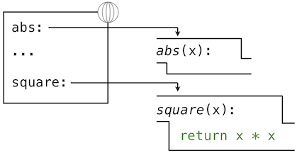
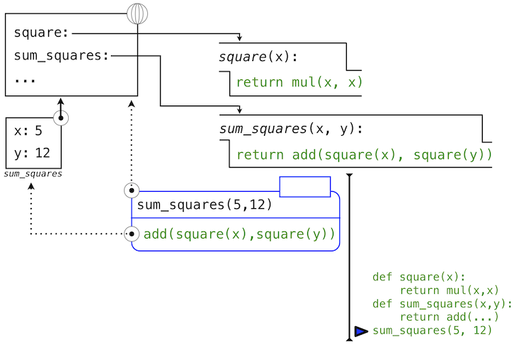

# 1.3 定义新的函数

> 来源：[1.3   Defining New Functions](http://www-inst.eecs.berkeley.edu/~cs61a/sp12/book/functions.html#defining-new-functions)

> 译者：[飞龙](https://github.com/wizardforcel)

> 协议：[CC BY-NC-SA 4.0](http://creativecommons.org/licenses/by-nc-sa/4.0/)

我们已经在 Python 中认识了一些在任何强大的编程语言中都会出现的元素：

1.  数值是内建数据，算数运算是函数。
2.  嵌套函数提供了组合操作的手段。
3.  名称到值的绑定提供了有限的抽象手段。

现在我们将要了解函数定义，一个更加强大的抽象技巧，名称通过它可以绑定到复合操作上，并可以作为一个单元来引用。

我们通过如何表达“平方”这个概念来开始。我们可能会说，“对一个数求平方就是将这个数乘上它自己”。在 Python 中就是：

```py
>>> def square(x):
        return mul(x, x)
```

这定义了一个新的函数，并赋予了名称`square`。这个用户定义的函数并不内建于解释器。它表示将一个数乘上自己的复合操作。定义中的`x`叫做形式参数，它为被乘的东西提供一个名称。这个定义创建了用户定义的函数，并且将它关联到名称`square`上。

函数定义包含`def`语句，它标明了`<name>`（名称）和一列带有名字的`<formal parameters>`（形式参数）。之后，`return`（返回）语句叫做函数体，指定了函数的`<return expression>`（返回表达式），它是函数无论什么时候调用都需要求值的表达式。

```py
def <name>(<formal parameters>):
    return <return expression>
```

第二行必须缩进！按照惯例我们应该缩进四个空格，而不是一个Tab，返回表达式并不是立即求值，它储存为新定义函数的一部分，并且只在函数最终调用时会被求出。（很快我们就会看到缩进区域可以跨越多行。）

定义了`square`之后，我们使用调用表达式来调用它：

```py
>>> square(21)
441
>>> square(add(2, 5))
49
>>> square(square(3))
81
```

我们也可以在构建其它函数时，将`square`用作构建块。列入，我们可以轻易定义`sum_squares`函数，它接受两个数值作为参数，并返回它们的平方和：

```py
>>> def sum_squares(x, y):
        return add(square(x), square(y))
>>> sum_squares(3, 4)
25
```

用户定义的函数和内建函数以同种方法使用。确实，我们不可能在`sum_squares`的定义中分辨出`square`是否构建于解释器中，从模块导入还是由用户定义。

## 1.3.1 环境

我们的 Python 子集已经足够复杂了，但程序的含义还不是非常明显。如果形式参数和内建函数具有相同名称会如何呢？两个函数是否能共享名称而不会产生混乱呢？为了解决这些疑问，我们必须详细描述环境。

表达式求值所在的环境由帧的序列组成，它们可以表述为一些盒子。每一帧都包含了一些绑定，它们将名称和对应的值关联起来。全局帧只有一个，它包含所有内建函数的名称绑定（只展示了`abs`和`max`）。我们使用地球符号来表示全局。


赋值和导入语句会向当前环境的第一个帧添加条目。到目前为止，我们的环境只包含全局帧。

```py
>>> from math import pi
>>> tau = 2 * pi
```


`def`语句也将绑定绑定到由定义创建的函数上。定义`square`之后的环境如图所示：



这些环境图示展示了当前环境中的绑定，以及它们所绑定的值（并不是任何帧的一部分）。要注意函数名称是重复的，一个在帧中，另一个是函数的一部分。这一重复是有意的，许多不同的名字可能会引用相同函数，但是函数本身只有一个内在名称。但是，在环境中由名称检索值只检查名称绑定。函数的内在名称不在名称检索中起作用。在我们之前看到的例子中：

```py
>>> f = max
>>> f
<built-in function max>
```

名称`max`是函数的内在名称，以及打印`f`时我们看到的名称。此外，名称`max`和`f`在全局环境中都绑定到了相同函数上。

在我们介绍 Python 的附加特性时，我们需要扩展这些图示。每次我们这样做的时候，我们都会列出图示可以表达的新特性。

**新的环境特性：**赋值和用户定义的函数定义。

## 1.3.2 调用用户定义的函数

为了求出运算符为用户定义函数的调用表达式，Python 解释器遵循与求出运算符为内建函数的表达式相似的过程。也就是说，解释器求出操作数表达式，并且对产生的实参调用具名函数。

调用用户定义的函数的行为引入了第二个局部帧，它只能由函数来访问。为了对一些实参调用用户定义的函数：

1.  在新的局部帧中，将实参绑定到函数的形式参数上。
2.  在当前帧的开头以及全局帧的末尾求出函数体。

函数体求值所在的环境由两个帧组成：第一个是局部帧，包含参数绑定，之后是全局帧，包含其它所有东西。每个函数示例都有自己的独立局部帧。


这张图包含两个不同的 Python 解释器层面：当前的环境，以及表达式树的一部分，它和要求值的代码的当前一行相关。我们描述了调用表达式的求值，用户定义的函数（蓝色）表示为两部分的圆角矩形。点线箭头表示哪个环境用于在每个部分求解表达式。

+ 上半部分展示了调用表达式的求值。这个调用表达式并不在任何函数里面，所以他在全局环境中求值。所以，任何里面的名称（例如`square`）都会在全局帧中检索。
+ 下半部分展示了`square`函数的函数体。它的返回表达式在上面的步骤1引入的新环境中求值，它将`square`的形式参数`x`的名称绑定到实参的值`-2`上。

环境中帧的顺序会影响由表达式中的名称检索返回的值。我们之前说名称求解为当前环境中与这个名称关联的值。我们现在可以更精确一些：

+ 名称求解为当前环境中，最先发现该名称的帧中，绑定到这个名称的值。

我们关于环境、名称和函数的概念框架建立了求值模型，虽然一些机制的细节仍旧没有指明（例如绑定如何实现），我们的模型在描述解释器如何求解调用表示上，变得更准确和正确。在第三章我们会看到这一模型如何用作一个蓝图来实现编程语言的可工作的解释器。

**新的环境特性：**函数调用。

## 1.3.3 示例：调用用户定义的函数

让我们再一次考虑两个简单的定义：

```py
>>> from operator import add, mul
>>> def square(x):
        return mul(x, x)
>>> def sum_squares(x, y):
        return add(square(x), square(y))
```


以及求解下列调用表达式的过程：

```py
>>> sum_squares(5, 12)
169
```

Python 首先会求出名称`sum_squares`，它在全局帧绑定了用户定义的函数。基本的数字表达式 5 和 12 求值为它们所表达的数值。

之后，Python 调用了`sum_squares`，它引入了局部帧，将`x`绑定为 5，将`y`绑定为 12。



这张图中，局部帧指向它的后继，全局帧。所有局部帧必须指向某个先导，这些链接定义了当前环境中的帧序列。

`sum_square`的函数体包含下列调用表达式：

```
   add     (  square(x)  ,  square(y)  )
 ________     _________     _________
"operator"   "operand 0"   "operand 1"
```

全部三个子表达式在当前环境中求值，它开始于标记为`sum_squares`的帧。运算符字表达式`add`是全局帧中发现的名称，绑定到了内建的加法函数上。两个操作数子表达式必须在加法函数调用之前依次求值。两个操作数都在当前环境中求值，开始于标记为`sum_squares`的帧。在下面的环境图示中，我们把这一帧叫做`A`，并且将指向这一帧的箭头同时替换为标签`A`。

在使用这个局部帧的情况下，函数体表达式`mul(x, x)`求值为 25。

我们的求值过程现在轮到了操作数 1，`y`的值为 12。Python 再次求出`square`的函数体。这次引入了另一个局部环境帧，将`x`绑定为 12。所以，操作数 1 求值为 144。


最后，对实参 25 和 144 调用加法会产生`sum_squares`函数体的最终值：169。

这张图虽然复杂，但是用于展示我们目前为止发展出的许多基础概念。名称绑定到值上面，它延伸到许多局部帧中，局部帧在唯一的全局帧之上，全局帧包含共享名称。表达式为树形结构，以及每次子表达式包含用户定义函数的调用时，环境必须被扩展。

所有这些机制的存在确保了名称在表达式中正确的地方解析为正确的值。这个例子展示了为什么我们的模型需要所引入的复杂性。所有三个局部帧都包含名称`x`的绑定。但是这个名称在不同的帧中绑定到了不同的值上。局部帧分离了这些名称。

## 1.3.4 局部名称

函数实现的细节之一是实现者对形式参数名称的选择不应影响函数行为。所以，下面的函数应具有相同的行为：

```py
>>> def square(x):
        return mul(x, x)
>>> def square(y):
        return mul(y, y)
```

这个原则 -- 也就是函数应不依赖于编写者选择的参数名称 -- 对编程语言来说具有重要的结果。最简单的结果就是函数参数名称应保留在函数体的局部范围中。

如果参数不位于相应函数的局部范围中，`square`的参数`x`可能和`sum_squares`中的参数`x`产生混乱。严格来说，这并不是问题所在：不同局部帧中的`x`的绑定是不相关的。我们的计算模型具有严谨的设计来确保这种独立性。

我们说局部名称的作用域被限制在定义它的用户定义函数的函数体中。当一个名称不能再被访问时，它就离开了作用域。作用域的行为并不是我们模型的新事实，它是环境的工作方式的结果。

## 1.3.5 实践指南：选择名称

可修改的名称并不代表形式参数的名称完全不重要。反之，选择良好的函数和参数名称对于函数定义的人类可解释性是必要的。

下面的准则派生于 [Python 的代码风格指南](http://www.python.org/dev/peps/pep-0008)，可被所有（非反叛）Python 程序员作为指南。一些共享的约定会使社区成员之间的沟通变得容易。遵循这些约定有一些副作用，我会发现你的代码在内部变得一致。

1.  函数名称应该小写，以下划线分隔。提倡描述性的名称。
2.  函数名称通常反映解释器向参数应用的操作（例如`print`、`add`、`square`），或者结果（例如`max`、`abs`、`sum`）。
3.  参数名称应小写，以下划线分隔。提倡单个词的名称。
4.  参数名称应该反映参数在函数中的作用，并不仅仅是满足的值的类型。
5.  当作用非常明确时，单个字母的参数名称可以接受，但是永远不要使用`l`（小写的`L`）和`O`（大写的`o`），或者`I`（大写的`i`）来避免和数字混淆。

周期性对你编写的程序复查这些准则，不用多久你的名称会变得十分 Python 化。

## 1.3.6 作为抽象的函数

虽然`sum_squares`十分简单，但是它演示了用户定义函数的最强大的特性。`sum_squares`函数使用`square`函数定义，但是仅仅依赖于`square`定义在输入参数和输出值之间的关系。

我们可以编写`sum_squares`，而不用考虑如何计算一个数值的平方。平方计算的细节被隐藏了，并可以在之后考虑。确实，在`sum_squares`看来，`square`并不是一个特定的函数体，而是某个函数的抽象，也就是所谓的函数式抽象。在这个层级的抽象中，任何能计算平方的函数都是等价的。

所以，仅仅考虑返回值的情况下，下面两个计算平方的函数是难以区分的。每个都接受数值参数并且产生那个数的平方作为返回值。

```py
>>> def square(x):
        return mul(x, x)
>>> def square(x):
        return mul(x, x-1) + x
```

换句话说，函数定义应该能够隐藏细节。函数的用户可能不能自己编写函数，但是可以从其它程序员那里获得它作为“黑盒”。用户不应该需要知道如何实现来调用。Python 库拥有这个特性。许多开发者使用在这里定义的函数，但是很少有人看过它们的实现。实际上，许多 Python 库的实现并不完全用 Python 编写，而是 C 语言。

## 1.3.7 运算符

算术运算符（例如`+`和`-`）在我们的第一个例子中提供了组合手段。但是我们还需要为包含这些运算符的表达式定义求值过程。

每个带有中缀运算符的 Python 表达式都有自己的求值过程，但是你通常可以认为他们是调用表达式的快捷方式。当你看到

```py
>>> 2 + 3
5
```

的时候，可以简单认为它是

```py
>>> add(2, 3)
5
```

的快捷方式。

中缀记号可以嵌套，就像调用表达式那样。Python 运算符优先级中采用了常规的数学规则，它指导了如何解释带有多种运算符的复合表达式。

```py
>>> 2 + 3 * 4 + 5
19
```

和下面的表达式的求值结果相同

```py
>>> add(add(2, mul(3, 4)) , 5)
19
```

调用表达式的嵌套比运算符版本更加明显。Python 也允许括号括起来的子表达式，来覆盖通常的优先级规则，或者使表达式的嵌套结构更加明显：

```py
>>> (2 + 3) * (4 + 5)
45
```

和下面的表达式的求值结果相同

```py
>>> mul(add(2, 3), add(4, 5))
45
```

你应该在你的程序中自由使用这些运算符和括号。对于简单的算术运算，Python 在惯例上倾向于运算符而不是调用表达式。
