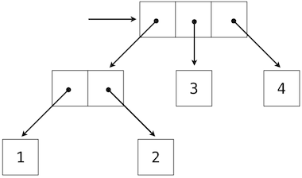

# 3.3 递归数据结构

> 来源：[3.3   Recursive Data Structures](http://www-inst.eecs.berkeley.edu/~cs61a/sp12/book/interpretation.html#recursive-data-structures)

> 译者：[飞龙](https://github.com/wizardforcel)

> 协议：[CC BY-NC-SA 4.0](http://creativecommons.org/licenses/by-nc-sa/4.0/)

在第二章中，我们引入了偶对的概念，作为一种将两个对象结合为一个对象的机制。我们展示了偶对可以使用内建元素来实现。偶对的封闭性表明偶对的每个元素本身都可以为偶对。

这种封闭性允许我们实现递归列表的数据抽象，它是我们的第一种序列类型。递归列表可以使用递归函数最为自然地操作，就像它们的名称和结构表示的那样。在这一节中，我们会讨论操作递归列表和其它递归结构的自定义的函数。

## 3.3.1 处理递归列表

递归列表结构将列表表示为首个元素和列表的剩余部分的组合。我们之前使用函数实现了递归列表，但是现在我们可以使用类来重新实现。下面，长度（`__len__`）和元素选择（`__getitem__`）被重写来展示处理递归列表的典型模式。

```py
>>> class Rlist(object):
        """A recursive list consisting of a first element and the rest."""
        class EmptyList(object):
            def __len__(self):
                return 0
        empty = EmptyList()
        def __init__(self, first, rest=empty):
            self.first = first
            self.rest = rest
        def __repr__(self):
            args = repr(self.first)
            if self.rest is not Rlist.empty:
                args += ', {0}'.format(repr(self.rest))
            return 'Rlist({0})'.format(args)
        def __len__(self):
            return 1 + len(self.rest)
        def __getitem__(self, i):
            if i == 0:
                return self.first
            return self.rest[i-1]
```

`__len__`和`__getitem__`的定义实际上是递归的，虽然不是那么明显。Python 内建函数`len`在自定义对象的参数上调用时会寻找叫做`__len__`的方法。与之类似，下标运算符会寻找叫做`__getitem__`的方法。于是，这些定义最后会调用对象自身。剩余部分上的递归调用是递归列表处理的普遍模式。这个递归列表的类定义与 Python 的内建序列和打印操作能够合理交互。

```py
>>> s = Rlist(1, Rlist(2, Rlist(3)))
>>> s.rest
Rlist(2, Rlist(3))
>>> len(s)
3
>>> s[1]
2
```

创建新列表的操作能够直接使用递归来表示。例如，我们可以定义`extend_rlist`函数，它接受两个递归列表作为参数并将二者的元素组合到新列表中。

```py
>>> def extend_rlist(s1, s2):
        if s1 is Rlist.empty:
            return s2
        return Rlist(s1.first, extend_rlist(s1.rest, s2))
>>> extend_rlist(s.rest, s)
Rlist(2, Rlist(3, Rlist(1, Rlist(2, Rlist(3)))))
```

与之类似，在递归列表上映射函数展示了相似的模式：

```py
>>> def map_rlist(s, fn):
        if s is Rlist.empty:
            return s
        return Rlist(fn(s.first), map_rlist(s.rest, fn))
>>> map_rlist(s, square)
Rlist(1, Rlist(4, Rlist(9)))
```

过滤操作包括额外的条件语句，但是也拥有相似的递归结构。

```py
>>> def filter_rlist(s, fn):
        if s is Rlist.empty:
            return s
        rest = filter_rlist(s.rest, fn)
        if fn(s.first):
            return Rlist(s.first, rest)
        return rest
>>> filter_rlist(s, lambda x: x % 2 == 1)
Rlist(1, Rlist(3))
```
列表操作的递归实现通常不需要局部赋值或者`while`语句。反之，递归列表可以作为函数调用的结果来拆分和构造。所以，它们拥有步骤数量和所需空间的线性增长度。

## 3.3.2 层次结构

层次结构产生于数据的封闭特性，例如，元组可以包含其它元组。考虑这个数值`1`到`4`的嵌套表示。

```py
>>> ((1, 2), 3, 4)
((1, 2), 3, 4)
```

这个元组是个长度为 3 的序列，它的第一个元素也是一个元组。这个嵌套结构的盒子和指针的图示表明，它可以看做拥有四个叶子的树，每个叶子都是一个数值。



在树中，每个子树本身都是一棵树。作为基本条件，任何本身不是元组的元素都是一个简单的树，没有任何枝干。也就是说，所有数值都是树，就像在偶对`(1, 2)`和整个结构中那样。

递归是用于处理树形结构的自然工具，因为我们通常可以将树的操作降至枝干的操作，它会相应产生枝干的枝干的操作，以此类推，直到我们到达了树的叶子。例如，我们可以实现`count_leaves`函数，它返回树的叶子总数。

```py
>>> t = ((1, 2), 3, 4)
>>> count_leaves(t)
4
>>> big_tree = ((t, t), 5)
>>> big_tree
((((1, 2), 3, 4), ((1, 2), 3, 4)), 5)
>>> count_leaves(big_tree)
9
```

正如`map`是用于处理序列的强大工具，映射和递归一起为树的操作提供了强大而通用的计算形式。例如，我们可以使用高阶递归函数`map_tree `将树的每个叶子平方，它的结构类似于`count_leaves`。

```py
>>> def map_tree(tree, fn):
        if type(tree) != tuple:
            return fn(tree)
        return tuple(map_tree(branch, fn) for branch in tree)
>>> map_tree(big_tree, square)
((((1, 4), 9, 16), ((1, 4), 9, 16)), 25)
```

**内部值。**上面描述的树只在叶子上存在值。另一个通用的树形结构表示也在树的内部节点上存在值。我们使用类来表示这种树。

```py
>>> class Tree(object):
        def __init__(self, entry, left=None, right=None):
            self.entry = entry
            self.left = left
            self.right = right
        def __repr__(self):
            args = repr(self.entry)
            if self.left or self.right:
                args += ', {0}, {1}'.format(repr(self.left), repr(self.right))
            return 'Tree({0})'.format(args)
```

例如，`Tree`类可以为`fib`的递归实现表示表达式树中计算的值。`fib`函数用于计算斐波那契数。下面的函数`fib_tree(n)`返回`Tree`，它将第 n 个斐波那契树作为`entry`，并将所有之前计算出来的斐波那契数存入它的枝干中。

```py
>>> def fib_tree(n):
        """Return a Tree that represents a recursive Fibonacci calculation."""
        if n == 1:
            return Tree(0)
        if n == 2:
            return Tree(1)
        left = fib_tree(n-2)
        right = fib_tree(n-1)
        return Tree(left.entry + right.entry, left, right)
>>> fib_tree(5)
Tree(3, Tree(1, Tree(0), Tree(1)), Tree(2, Tree(1), Tree(1, Tree(0), Tree(1))))
```

这个例子表明，表达式树可以使用树形结构编程表示。嵌套表达式和树形数据结构的联系，在我们这一章稍后对解释器设计的讨论中起到核心作用。

## 3.3.3 集合

除了列表、元组和字典之外，Python 拥有第四种容器类型，叫做`set`。集合字面值遵循元素以花括号闭合的数学表示。重复的元素在构造中会移除。集合是无序容器，所以打印出来的顺序可能和元素在集合字面值中的顺序不同。

```py
>>> s = {3, 2, 1, 4, 4}
>>> s
{1, 2, 3, 4}
```

Python 的集合支持多种操作，包括成员测试、长度计算和标准的交集并集操作。

```py
>>> 3 in s
True
>>> len(s)
4
>>> s.union({1, 5})
{1, 2, 3, 4, 5}
>>> s.intersection({6, 5, 4, 3})
{3, 4}
```

除了`union`和`intersection`，Python 的集合还支持多种其它操作。断言`isdisjoint`、`issubset`和`issuperset`提供了集合比较操作。集合是可变的，并且可以使用`add`、`remove`、`discard`和`pop`一次修改一个元素。额外的方法提供了多元素的修改，例如`clear`和`update`。Python [集合文档](http://docs.python.org/py3k/library/stdtypes.html#set)十分详细并足够易懂。

**实现集合。**抽象上，集合是不同对象的容器，支持成员测试、交集、并集和附加操作。向集合添加元素会返回新的集合，它包含原始集合的所有元素，如果没有重复的话，也包含新的元素。并集和交集运算返回出现在任意一个或两个集合中的元素构成的集合。就像任何数据抽象那样，我们可以随意实现任何集合表示上的任何函数，只要它们提供这种行为。

在这章的剩余部分，我们会考虑三个实现集合的不同方式，它们在表示上不同。我们会通过分析集合操作的增长度，刻画这些不同表示的效率。我们也会使用这一章之前的`Rlist`和`Tree`类，它们可以编写用于集合元素操作的简单而优雅的递归解决方案。

**作为无序序列的集合。**一种集合的表示方式是看做没有出现多于一次的元素的序列。空集由空序列来表示。成员测试会递归遍历整个列表。

```py
>>> def empty(s):
        return s is Rlist.empty
>>> def set_contains(s, v):
        """Return True if and only if set s contains v."""
        if empty(s):
            return False
        elif s.first == v:
            return True
        return set_contains(s.rest, v)
>>> s = Rlist(1, Rlist(2, Rlist(3)))
>>> set_contains(s, 2)
True
>>> set_contains(s, 5)
False
```

这个`set_contains `的实现需要`Θ(n)`的时间来测试元素的成员性，其中`n`是集合`s`的大小。使用这个线性时间的成员测试函数，我们可以将元素添加到集合中，也是线性时间。

```py
>>> def adjoin_set(s, v):
        """Return a set containing all elements of s and element v."""
        if set_contains(s, v):
            return s
        return Rlist(v, s)
>>> t = adjoin_set(s, 4)
>>> t
Rlist(4, Rlist(1, Rlist(2, Rlist(3))))
```

那么问题来了，我们应该在设计表示时关注效率。计算两个集合`set1`和`set2`的交集需要成员测试，但是这次每个`set1`的元素必须测试`set2`中的成员性，对于两个大小为`n`的集合，这会产生步骤数量的平方增长度`Θ(n^2)`。

```py
>>> def intersect_set(set1, set2):
        """Return a set containing all elements common to set1 and set2."""
        return filter_rlist(set1, lambda v: set_contains(set2, v))
>>> intersect_set(t, map_rlist(s, square))
Rlist(4, Rlist(1))
```

在计算两个集合的并集时，我们必须小心避免两次包含任意一个元素。`union_set `函数也需要线性数量的成员测试，同样会产生包含`Θ(n^2)`步骤的过程。

```py
>>> def union_set(set1, set2):
        """Return a set containing all elements either in set1 or set2."""
        set1_not_set2 = filter_rlist(set1, lambda v: not set_contains(set2, v))
        return extend_rlist(set1_not_set2, set2)
>>> union_set(t, s)
Rlist(4, Rlist(1, Rlist(2, Rlist(3))))
```

**作为有序元组的集合。**一种加速我们的集合操作的方式是修改表示，使集合元素递增排列。为了这样做，我们需要一些比较两个对象的方式，使我们能判断哪个更大。Python 中，许多不同对象类型都可以使用`<`和`>`运算符比较，但是我们会专注于这个例子中的数值。我们会通过将元素递增排列来表示数值集合。

有序的一个优点会在`set_contains`体现：在检查对象是否存在时，我们不再需要扫描整个集合。如果我们到达了大于要寻找的元素的集合元素，我们就知道这个元素不在集合中：

```py
>>> def set_contains(s, v):
        if empty(s) or s.first > v:
            return False
        elif s.first == v:
            return True
        return set_contains(s.rest, v)
>>> set_contains(s, 0)
False
```

这节省了多少步呢？最坏的情况中，我们所寻找的元素可能是集合中最大的元素，所以步骤数量和无序表示相同。另一方面，如果我们寻找许多不同大小的元素，我们可以预料到有时我们可以在列表开头的位置停止搜索，其它情况下我们仍旧需要检测整个列表。平均上我们应该需要检测集合中一半的元素。所以，步骤数量的平均值应该是`n/2`。这还是`Θ(n)`的增长度，但是它确实会在平均上为我们节省之前实现的一半步骤数量。

我们可以通过重新实现`intersect_set`获取更加可观的速度提升。在无序表示中，这个操作需要`Θ(n^2)`的步骤，因为我们对`set1`的每个元素执行`set2`上的完整扫描。但是使用有序的实现，我们可以使用更加机智的方式。我们同时迭代两个集合，跟踪`set1`中的元素`e1`和`set2`中的元素`e2`。当`e1`和`e2`相等时，我们在交集中添加该元素。

但是，假设`e1`小于`e2`，由于`e2`比`set2`的剩余元素更小，我们可以立即推断出`e1`不会出现在`set2`剩余部分的任何位置，因此也不会出现在交集中。所以，我们不再需要考虑`e1`，我们将它丢弃并来到`set1`的下一个元素。当`e2 < e1`时，我们可以使用相似的逻辑来步进`set2`中的元素。下面是这个函数：

```py
>>> def intersect_set(set1, set2):
        if empty(set1) or empty(set2):
            return Rlist.empty
        e1, e2 = set1.first, set2.first
        if e1 == e2:
            return Rlist(e1, intersect_set(set1.rest, set2.rest))
        elif e1 < e2:
            return intersect_set(set1.rest, set2)
        elif e2 < e1:
            return intersect_set(set1, set2.rest)
>>> intersect_set(s, s.rest)
Rlist(2, Rlist(3))
```

为了估计这个过程所需的步骤数量，观察每一步我们都缩小了至少集合的一个元素的大小。所以，所需的步骤数量最多为`set1`和`set2`的大小之和，而不是无序表示所需的大小之积。这是`Θ(n)`而不是`Θ(n^2)`的增长度 -- 即使集合大小适中，它也是一个相当可观的加速。例如，两个大小为`100`的集合的交集需要 `200`步，而不是无序表示的 10000 步。

表示为有序序列的集合的添加和并集操作也以线性时间计算。这些实现都留做练习。

**作为二叉树的集合。**我们可以比有序列表表示做得更好，通过将几个元素重新以树的形式排列。我们使用之前引入的`Tree`类。树根的`entry`持有集合的一个元素。`left`分支的元素包括所有小于树根元素的元素。`right`分支的元素包括所有大于树根元素的元素。下面的图展示了一些树，它们表示集合`{1, 3, 5, 7, 9, 11}`。相同的集合可能会以不同形式的树来表示。有效表示所需的唯一条件就是所有`left`子树的元素应该小于`entry`，并且所有`right`子树的元素应该大于它。


树形表示的优点是：假设我们打算检查`v`是否在集合中。我们通过将`v`于`entry`比较开始。如果`v`小于它，我们就知道了我们只需要搜索`left`子树。如果`v`大于它，我们只需要搜索`right`子树。现在如果树是“平衡”的，每个这些子树都约为整个的一半大小。所以，每一步中我们都可以将大小为`n`的树的搜索问题降至搜索大小为`n/2`的子树。由于树的大小在每一步减半，我们应该预料到，用户搜索树的步骤以`Θ(log n)`增长。比起之前的表示，它的速度对于大型集合有可观的提升。`set_contains `函数利用了树形集合的有序结构：

```py
>>> def set_contains(s, v):
        if s is None:
            return False
        elif s.entry == v:
            return True
        elif s.entry < v:
            return set_contains(s.right, v)
        elif s.entry > v:
            return set_contains(s.left, v)
```

向集合添加元素与之类似，并且也需要`Θ(log n)`的增长度。为了添加值`v`，我们将`v`与`entry`比较，来决定`v`应该添加到`right`还是`left`分支，以及是否已经将`v`添加到了合适的分支上。我们将这个新构造的分支与原始的`entry`和其它分支组合。如果`v`等于`entry`，我们就可以返回这个节点。如果我们被要求将`v`添加到空的树中，我们会生成一个`Tree`，它包含`v`作为`entry`，并且`left`和`right`都是空的分支。下面是这个函数：

```py
>>> def adjoin_set(s, v):
        if s is None:
            return Tree(v)
        if s.entry == v:
            return s
        if s.entry < v:
            return Tree(s.entry, s.left, adjoin_set(s.right, v))
        if s.entry > v:
            return Tree(s.entry, adjoin_set(s.left, v), s.right)

>>> adjoin_set(adjoin_set(adjoin_set(None, 2), 3), 1)
Tree(2, Tree(1), Tree(3))
```

搜索该树可以以对数步骤数量执行，我们这个叙述基于树是“平衡”的假设。也就是说，树的左子树和右子树都拥有相同数量的相应元素，使每个子树含有母树一半的元素。但是我们如何确定，我们构造的树就是平衡的呢？即使我们以一颗平衡树开始，使用`adjoin_set`添加元素也会产生不平衡的结果。由于新添加的元素位置取决于如何将元素与集合中的已有元素比较，我们可以预测，如果我们“随机”添加元素到树中，树在平均上就会趋向于平衡。

但是这不是一个保证。例如，如果我们以空集开始，并向序列中添加 1 到 7，我们就会在最后得到很不平衡的树，其中所有左子树都是空的，所以它与简单的有序列表相比并没有什么优势。一种解决这个问题的方式是定义一种操作，它将任意的树转换为具有相同元素的平衡树。我们可以在每个`adjoin_set`操作之后执行这个转换来保证我们的集合是平衡的。

交集和并集操作可以在树形集合上以线性时间执行，通过将它们转换为有序的列表，并转换回来。细节留做练习。

**Python 集合实现。**Python 内建的`set`类型并没有使用上述任意一种表示。反之，Python 使用了一种实现，它的成员测试和添加操作是（近似）常量时间的，基于一种叫做哈希（散列）的机制，这是其它课程的话题。内建的 Python 集合不能包含可变的数据类型，例如列表、字典或者其它集合。为了能够嵌套集合，Python 也提供了一种内建的不可变`frozenset `类，除了可变操作和运算符之外，它拥有和`set`相同的方法。
